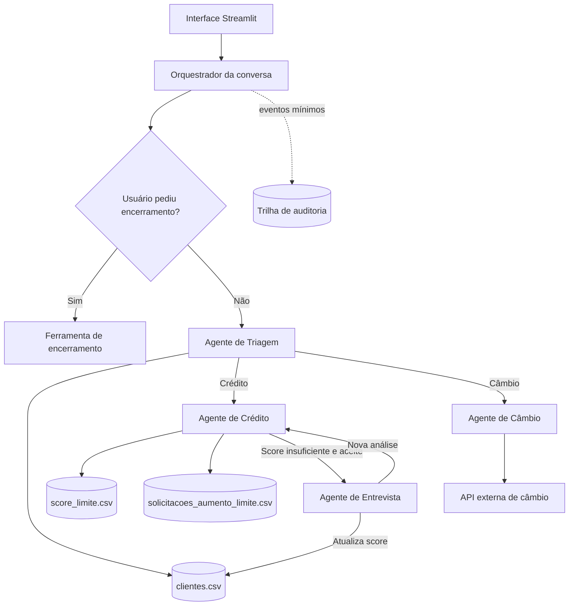

# Banco Ágil - Agente Bancário Inteligente

[](https://github.com/guisefe/banco-agil-agent/actions/workflows/ci.yml)


MVP de atendimento bancário conversacional com quatro agentes especializados, interface
Streamlit e orquestração por LangGraph. A solução cobre o fluxo completo do desafio técnico
da Tech For Humans: autenticação, crédito, entrevista financeira, reanálise e câmbio.

> **Entrega completa:** 268 testes, 100% de linhas e branches cobertos, MyPy strict, Ruff,
> CI, auditoria pseudonimizada e container não-root com health check.

## Visão Geral do Projeto

Para o cliente, o Banco Ágil se comporta como um único assistente. Internamente, o
atendimento é dividido entre quatro agentes com escopos bem definidos:

| Agente | Responsabilidade |
| --- | --- |
| Triagem | Recepcionar, autenticar por CPF e nascimento e identificar a solicitação. |
| Crédito | Consultar limite e processar pedidos de aumento de crédito. |
| Entrevista de Crédito | Coletar informações financeiras e recalcular o score. |
| Câmbio | Consultar cotações atuais por meio de uma API externa. |

O usuário pode solicitar o encerramento a qualquer momento. As transições entre agentes
são implícitas, preservando a experiência de uma conversa única.

### Fluxos demonstráveis

| Fluxo | Resultado |
| --- | --- |
| Autenticação | Valida CPF e nascimento no `clientes.csv`, com até três tentativas. |
| Consulta de crédito | Exibe o limite atual somente após autenticação. |
| Aumento de limite | Registra o pedido e aplica a política do `score_limite.csv`. Sem score, mantém o pedido pendente e oferece entrevista. |
| Entrevista financeira | Recalcula o score, atualiza o cliente e reanalisa o pedido original. |
| Câmbio | Consulta a AwesomeAPI e retorna a cotação atual pela mesma interface. |
| Consulta de score | Informa o score interno de 0–1000 ou explica que ele ainda não foi calculado. |
| Encerramento | Finaliza qualquer etapa e remove dados pessoais e financeiros do estado. |

## Arquitetura do Sistema



### Componentes

- **Interface:** Streamlit oferece o chat usado para simular o atendimento disponível.
- **Orquestração:** um grafo de estados controla turnos, autenticação, handoffs e
  encerramento.
- **Agentes:** cada agente executa apenas ações pertencentes ao seu escopo.
- **Ferramentas:** autenticação, leitura e escrita de CSV, cálculo de score, consulta de
  câmbio e encerramento são funções explícitas e testáveis.
- **Auditoria:** eventos de negócio são registrados separadamente das mensagens e dos
  dados financeiros.

### Fluxo de autenticação

1. A Triagem solicita CPF e data de nascimento separadamente.
2. Os dados são comparados com `clientes.csv`.
3. Após uma autenticação válida, a intenção do cliente é identificada e encaminhada no
   mesmo turno, sem obrigá-lo a repetir o pedido.
4. Em caso de falha, são permitidas mais duas tentativas.
5. A terceira falha consecutiva encerra o atendimento de maneira amigável.

Nenhum agente de Crédito, Entrevista ou Câmbio será acessado antes da autenticação.

### Manipulação dos dados

| Recurso | Operação | Finalidade |
| --- | --- | --- |
| `clientes.csv` | Leitura e atualização controlada | Autenticação, limite e score do cliente. |
| `score_limite.csv` | Somente leitura | Determinar o limite permitido para cada faixa de score. |
| `solicitacoes_aumento_limite.csv` | Escrita | Registrar solicitações com o esquema exigido pelo desafio. |
| API de câmbio | Consulta | Obter cotação atual da moeda solicitada. |
| Auditoria JSONL | Append-only no MVP | Registrar eventos técnicos e de negócio sem dados brutos. |

Os três nomes de arquivo CSV foram mantidos literalmente porque são obrigatórios no PDF do
desafio. Renomeá-los deixaria a entrega mais elegante, mas quebraria a aderência à
especificação. Em uma aplicação real, eles seriam tabelas ou recursos com nomes de domínio,
por exemplo `customers`, `credit_limit_policy` e `credit_limit_requests`.

### Dicionário dos CSVs

| Arquivo | Campo | Significado |
| --- | --- | --- |
| `clientes.csv` | `cpf` | Identificador fictício usado na autenticação da demonstração. |
| `clientes.csv` | `nome` | Nome fictício exibido após autenticação. |
| `clientes.csv` | `data_nascimento` | Data ISO usada com o CPF para confirmar identidade. |
| `clientes.csv` | `limite_credito` | Limite total atual, armazenado com duas casas decimais. |
| `clientes.csv` | `score` | Score interno de 0–1000; vazio significa “ainda não calculado”, nunca score negativo. |
| `score_limite.csv` | `score_minimo` / `score_maximo` | Faixa inclusiva da política determinística. |
| `score_limite.csv` | `limite_maximo` | Maior limite total permitido para a faixa. |
| `solicitacoes_aumento_limite.csv` | `data_hora_solicitacao` | Instante UTC em ISO 8601. |
| `solicitacoes_aumento_limite.csv` | `limite_atual` / `novo_limite_solicitado` | Valores considerados no pedido. |
| `solicitacoes_aumento_limite.csv` | `status_pedido` | `pendente`, `aprovado` ou `rejeitado`. |

O conjunto de demonstração contém cinco perfis fictícios distribuídos por faixas diferentes,
incluindo um cliente sem score para validar o caminho pendente → entrevista → reanálise.

CPF e data de nascimento são utilizados no fluxo funcional exigido pelo desafio, mas não
são gravados na auditoria. Quando for necessário correlacionar eventos, o titular será
representado por uma referência pseudonimizada com HMAC-SHA-256. Veja as decisões e
limitações em [Privacidade e Auditoria](docs/PRIVACY_AND_AUDIT.md).

## Funcionalidades Implementadas

| Capacidade | Implementação |
| --- | --- |
| Identidade | CPF + nascimento, três tentativas, dados fictícios e falhas controladas. |
| Crédito | Consulta, aumento, decisão determinística, persistência e rollback. |
| Entrevista | Cinco perguntas, score versionado entre 0–1000 e compensação em falha. |
| Câmbio | USD, EUR, ARS, GBP e JPY; timeout, retry de transporte e payload validado. |
| Orquestração | LangGraph, estado tipado, escopos isolados e handoffs invisíveis. |
| Interface | Streamlit cobrindo os quatro agentes, com feedback de processamento, recuperação de falhas e mascaramento parcial. |
| Auditoria | JSONL mínimo, motivos controlados e referência HMAC-SHA-256. |
| Qualidade | Pytest, cobertura integral, Ruff, MyPy strict, CI e Dependabot. |
| Entrega | Execução local ou Docker não-root com health check verificado na CI. |

## Estrutura do Código

```text
app/
├── agents/          # Comportamento e escopo de cada agente
├── audit/           # Eventos, pseudonimização e persistência de auditoria
├── models/          # Estado e tipos compartilhados da conversa
├── repositories/    # Clientes, política de score e solicitações em CSV
├── tools/           # Identidade, valores monetários e encerramento
├── graph/           # Orquestração e roteamento entre agentes disponíveis
└── ui/              # Interface Streamlit e proteção de dados exibidos
tests/               # Testes unitários e de integração
docs/                # Decisões de arquitetura, privacidade e operação
```

## Desafios Enfrentados e Como Foram Resolvidos

### Rastreabilidade sem expor dados pessoais

Registrar conversas completas facilitaria a depuração, mas aumentaria a exposição de CPF,
nascimento e informações financeiras. A solução foi auditar eventos mínimos, motivos
controlados e versões das regras. A referência do titular é pseudonimizada e a chave não é
armazenada no Git.

### Decisões de crédito explicáveis

Uma LLM não participa da autenticação, aprovação de crédito ou cálculo de score. Essas
decisões são determinísticas e registram `reason_code` e `policy_version`, permitindo
reprodução, teste e revisão.

### Confiabilidade desde o início

O limite mínimo de cobertura inicialmente falhava porque ainda não havia testes. Foram
adicionados testes unitários para estado e auditoria, além de um pipeline que impede a
integração de código sem formatação, lint, tipagem e testes aprovados.

### Consistência entre pedido e limite aprovado

Os CSVs exigidos não oferecem transações entre arquivos. No MVP de processo único, a
decisão completa é serializada para sempre validar o pedido contra o limite mais recente.
A atualização do cliente usa substituição atômica e o caso de falha ao registrar uma
aprovação restaura o limite anterior. Em produção, os dois registros pertenceriam à mesma
transação em um banco de dados e teriam chave de idempotência.

### Recálculo reproduzível sem decisão da LLM

A fórmula sugerida pelo desafio foi implementada com `Decimal`, pesos explícitos e
arredondamento `ROUND_HALF_UP`. O resultado é limitado entre 0 e 1000 antes de ser salvo.
Se a auditoria crítica do novo score falhar, o repositório restaura o score anterior; uma
falha posterior apenas no evento de handoff não desfaz uma atualização já confirmada.

O peso de dívida ativa é negativo dentro da fórmula, mas o score final nunca é negativo:
antes da gravação, o resultado é limitado ao intervalo inclusivo de **0 a 1000**. Um campo
vazio representa ausência de avaliação; `0` representa um score calculado válido.

### Linguagem natural sem abrir mão do determinismo

A compreensão de intenções usa um vocabulário explícito e testável. Frases como “quero saber
meu score”, “qual meu limite”, “quero mais limite” e “cotação do dólar” são processadas no
mesmo turno do handoff. Uma LLM continua fora de autenticação, score e aprovação. Em uma
evolução, ela poderia classificar apenas mensagens ambíguas, com fallback determinístico.

### Integração externa resiliente

O agente de Câmbio usa a AwesomeAPI por meio de um adaptador isolado. O adaptador aceita
somente USD, EUR, ARS, GBP e JPY, aplica timeout de cinco segundos e faz uma única repetição
para falhas de transporte. Respostas HTTP não exitosas, payloads inválidos e indisponibilidade
retornam uma mensagem controlada, sem expor detalhes técnicos ou o conteúdo da resposta.

### Limite claro entre MVP e produção

CSV e JSONL são proporcionais ao desafio e tornam a demonstração reproduzível. Eles não
simulam garantias inexistentes: uma implantação bancária real exigiria banco transacional,
auditoria centralizada e imutável, gestão de segredos, autorização, rate limiting,
observabilidade, retenção formal e procedimentos operacionais.

## Escolhas Técnicas e Justificativas

| Escolha | Justificativa |
| --- | --- |
| Python 3.12 | Tipagem moderna, ecossistema de IA e compatibilidade com o desafio. |
| `uv` | Instalação rápida e ambiente reproduzível por meio de `uv.lock`. |
| `httpx` | Cliente HTTP com timeout explícito e transporte simulável nos testes. |
| Estado tipado | Torna transições explícitas e reduz erros entre agentes. |
| Regras determinísticas | Garante autenticação, score e crédito reproduzíveis e testáveis. |
| Grafo de estados | Representa os handoffs e impede que agentes atuem fora do escopo. |
| Streamlit | Permite construir rapidamente a UI simples solicitada no desafio. |
| CSV por repositórios/ferramentas | Cumpre a especificação sem acoplar os agentes ao armazenamento. |
| Auditoria estruturada | Oferece rastreabilidade sem armazenar o conteúdo completo da conversa. |
| Pytest, Ruff e MyPy | Automatizam testes, padronização e verificação estática. |
| GitHub Actions | Executa os mesmos controles em toda PR e na branch principal. |
| Docker não-root | Empacota a demonstração sem executar a aplicação como administrador. |

O MVP não depende de uma LLM. A interpretação necessária é deliberadamente determinística,
adequada ao vocabulário fechado do desafio e executável sem credenciais pagas. Uma LLM
poderia ser adicionada futuramente apenas para linguagem ambígua ou formulação de respostas,
sempre com fallback determinístico e sem participar das regras críticas.

## Tutorial de Execução e Testes

### Pré-requisitos

- Python 3.12 ou superior;
- [uv](https://docs.astral.sh/uv/);
- Git.

### Preparação do ambiente

```bash
git clone https://github.com/guisefe/banco-agil-agent.git
cd banco-agil-agent
uv sync --locked --dev
```

Para manter uma referência de auditoria estável entre reinicializações, configure uma
chave secreta de pelo menos 32 bytes. Sem ela, a demonstração gera uma chave efêmera segura
por processo:

```bash
export AUDIT_PSEUDONYMIZATION_KEY="substitua-por-um-segredo-com-32-bytes-ou-mais"
```

Opcionalmente, configure uma chave da AwesomeAPI fora do Git. A demonstração funciona sem
ela quando o provedor permite a consulta pública:

```bash
export EXCHANGE_API_KEY="sua-chave-opcional"
```

### Testes e qualidade

```bash
uv run ruff format --check .
uv run ruff check .
uv run mypy app tests
uv run pytest
```

O `pytest` mede a cobertura do pacote `app` e falha quando o total fica abaixo de 95%.
Esses mesmos comandos são executados automaticamente pelo GitHub Actions.

### Executar com Docker

O container executa o mesmo aplicativo Streamlit com usuário sem privilégios e possui
health check no endpoint nativo do Streamlit:

```bash
docker build -t banco-agil-agent .
docker run --rm -p 8501:8501 \
  -e AUDIT_PSEUDONYMIZATION_KEY="substitua-por-um-segredo-com-32-bytes-ou-mais" \
  banco-agil-agent
```

Acesse `http://localhost:8501`. A CI constrói a imagem e aguarda o container ficar
saudável antes de permitir a integração.

### Executar a aplicação

```bash
uv run streamlit run streamlit_app.py --server.address=0.0.0.0 --server.port=8501
```

Use um dos clientes fictícios para testar a Triagem:

| Perfil | CPF | Nascimento | Score inicial | Uso recomendado |
| --- | --- | --- | ---: | --- |
| Ana Martins | `000.000.000-00` | `20/05/1990` | 650 | Consulta e aprovação até R$ 5.000. |
| Carlos Oliveira | `111.111.111-11` | `03/11/1985` | 780 | Faixa de limite superior. |
| Mariana Souza | `222.222.222-22` | `14/02/1995` | ausente | Pedido pendente e entrevista obrigatória. |
| João Pereira | `333.333.333-33` | `08/09/1978` | 280 | Rejeição por faixa baixa. |
| Beatriz Santos | `444.444.444-44` | `01/12/2000` | 910 | Maior faixa da política. |

Depois da autenticação, escolha crédito e consulte o limite ou solicite um aumento. Para o
cliente com score 650, `R$ 5.000,00` é aprovado e um valor superior oferece a entrevista.
Responda às cinco perguntas; ao final, o score é atualizado e o mesmo limite é reanalisado
automaticamente. Para câmbio, peça a cotação de dólar, euro, peso argentino, libra ou iene;
após a resposta, o atendimento retorna naturalmente ao menu. Nenhuma chave real deve ser
adicionada ao repositório.

### Roteiro manual de aceite

1. Abra `http://localhost:8501` e confirme que o campo de mensagem está habilitado.
2. Informe `000.000.000-00`; o chat deve mostrar apenas `***.***.***-00`.
3. Informe `20/05/1990`; o chat deve mostrar apenas `**/**/1990`.
4. Escreva `quero saber meu score`; a resposta deve informar `650 de 1000` sem pedir que
   você repita a intenção.
5. Escreva `quero aumentar meu limite`; informe `R$ 5.000,00`; o pedido deve ser aprovado,
   o limite atualizado e uma linha adicionada ao CSV de solicitações.
6. Inicie uma nova conversa com Mariana Souza e peça `quero limite de 6000`; como o score
   está vazio, o pedido deve ficar `pendente` e a entrevista deve ser oferecida.
7. Aceite e responda, por exemplo: renda `10000`, emprego `formal`, despesas `1000`,
   dependentes `0`, dívidas `não`. O score deve permanecer entre 0 e 1000 e o mesmo pedido
   deve ser reanalisado, sem criar duas solicitações.
8. Peça `cotação do dólar`; uma resposta válida deve chegar no mesmo turno ou uma mensagem
   controlada deve informar a indisponibilidade do provedor.
9. Em qualquer etapa, escreva `encerrar`; o campo de entrada deve ser desabilitado e o botão
   **Nova conversa** deve iniciar uma sessão limpa.

> Os testes manuais alteram os CSVs. Para repetir a demonstração, restaure os três arquivos
> em `data/` a partir do Git ou execute sobre cópias descartáveis.

### Se a interface parecer travada ou desconectar

- aguarde a mensagem “Processando sua solicitação...” durante a consulta externa;
- confirme que o terminal continua executando o Streamlit na porta 8501;
- em Codespaces, abra a porta encaminhada 8501 e verifique se a visibilidade está adequada;
- execute `curl --fail http://localhost:8501/_stcore/health` para testar a saúde do servidor;
- se uma operação falhar, a UI preserva a sessão e permite tentar novamente;
- use **Nova conversa** apenas quando desejar descartar o estado atual.

## Aderência bancária brasileira: escopo e limites

O MVP segue a lógica prudente de não aprovar crédito sem dados suficientes para avaliar o
risco. Isso não significa que todo banco exija um score externo específico: instituições
reais combinam histórico interno, renda e capacidade de pagamento, endividamento, dados de
mercado, SCR, Open Finance e, em alguns produtos, garantias. Neste projeto, score ausente
bloqueia apenas a **aprovação automática sem garantia** e conduz à entrevista.

O sistema é adequado ao desafio técnico, mas não deve ser apresentado como motor bancário
de produção. Ficam fora do escopo KYC e antifraude completos, prevenção à lavagem de dinheiro,
consulta autorizada a SCR/Open Finance, verificação documental de renda, política de
superendividamento, canal operacional de revisão humana, governança de modelo e banco de
dados transacional.

## Segurança e Privacidade

Este é um projeto educacional com dados fictícios. As medidas implementadas são alinhadas
a princípios de segurança e proteção de dados, mas não constituem certificação de
conformidade legal para uso bancário em produção.

Consulte [docs/PRIVACY_AND_AUDIT.md](docs/PRIVACY_AND_AUDIT.md) para conhecer o contrato de
minimização, as limitações do JSONL, os requisitos de produção e as referências oficiais.
