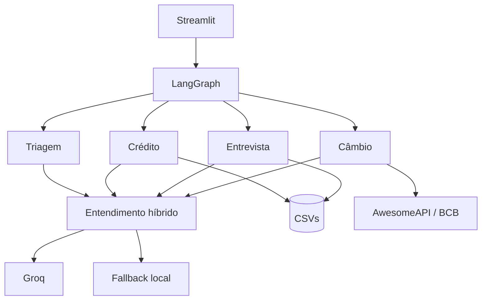

# Banco Ágil

[](https://github.com/guisefe/banco-agil-agent/actions/workflows/ci.yml)

[](https://github.com/langchain-ai/langgraph)


Assistente bancário desenvolvido para o desafio técnico da Tech For Humans. O cliente conversa
por uma única interface Streamlit; internamente, quatro agentes LangGraph cuidam de Triagem,
Crédito, Entrevista de Crédito e Câmbio.

> **A LLM entende a mensagem; o código aplica as regras.** Autenticação, score, aprovação,
> persistência e auditoria nunca dependem da resposta do modelo.

## Executar em 5 minutos

Requisitos: Python 3.12 e [uv](https://docs.astral.sh/uv/).

```bash
git clone https://github.com/guisefe/banco-agil-agent.git
cd banco-agil-agent
cp .env.example .env
unset VIRTUAL_ENV
uv sync --locked --dev
uv run streamlit run streamlit_app.py
```

Abra `http://localhost:8501`. Se a pasta já existir, entre nela e comece em
`cp .env.example .env`; não faça outro clone dentro do primeiro.

### Ativar a LLM

Edite `.env` e informe sua chave:

```dotenv
GROQ_API_KEY=sua-chave-groq
LLM_MODEL=openai/gpt-oss-20b
```

O arquivo é carregado automaticamente. Depois de alterar a chave, pare o Streamlit com
`Ctrl+C` e inicie novamente. Sem chave, a aplicação continua disponível, mas usa somente o
fallback local — esse modo não demonstra a integração com LLM.

A barra lateral informa o que aconteceu no último turno:

- `LLM ativa`: a Groq interpretou a mensagem;
- `LLM falhou — fallback ativo`: houve timeout, erro HTTP ou saída inválida;
- `fallback local`: nenhuma chave foi configurada;
- `LLM configurada — aguardando mensagem`: a chave foi lida, mas ainda não houve chamada.

### Dados fictícios para demonstração

| Cenário | CPF | Nascimento | Uso sugerido |
| --- | --- | --- | --- |
| Ana Martins | `00000000000` | `20/05/1990` | Consultar score/limite e testar aumento ou redução. |
| Mariana Souza | `22222222222` | `14/02/1995` | Testar cliente sem score e entrevista. |
| João Pereira | `33333333333` | `08/09/1978` | Exercitar score baixo e possível rejeição. |
| Rafael Lima | `77777777777` | `11/07/1992` | Validar a fronteira inicial da segunda faixa (`300`). |
| Diego Nascimento | `99999999999` | `05/01/2002` | Validar personalização e score máximo (`1000`). |

Os identificadores são fixtures sintéticas do desafio, não CPFs reais.

### Roteiro manual principal

1. Abra o chat e envie “Olá”; confirme que o assistente só então saúda e solicita o CPF.
2. Em uma nova conversa, envie diretamente “qual é meu limite?”; autentique-se como Ana e
   confirme que o assistente a chama pelo nome e retoma o pedido sem precisar ser repetido.
3. Pergunte “qual é meu score?” e escreva “preciso de um fôlego de quatro mil no cartão”.
4. Confirme `LLM ativa` na barra lateral e veja a decisão determinística de crédito.
5. Peça um limite menor que o atual, confirme a redução e consulte o limite novamente.
6. Inicie outra conversa como Mariana e solicite um aumento.
7. Conclua a entrevista com respostas naturais, como “trabalho registrado” e “não tenho
   dívidas”.
8. Confirme que o pedido original é reanalisado sem redigitar o valor.
9. Peça “quanto está a moeda dos Estados Unidos?”.
10. Responda “não” após o serviço e confirme o encerramento quando solicitado.
11. Em outra conversa, use o CPF não cadastrado `12345678901` e uma data válida. Confirme o
    CPF ou corrija-o quando solicitado; o sistema deve respeitar as três tentativas, orientar um
    canal de cadastro e se despedir antes de encerrar.

Crédito altera os CSVs. Faça uma cópia de `data/` antes de repetir a demonstração.

## Funcionalidades entregues

| Agente | Responsabilidade |
| --- | --- |
| Triagem | Ativa a conversa após a primeira mensagem, autentica por CPF + nascimento em até três tentativas e só então identifica o pedido. |
| Crédito | Consulta score/limite, decide aumentos pela política e confirma reduções solicitadas. |
| Entrevista | Coleta cinco dados financeiros, recalcula o score e retorna para reanálise. |
| Câmbio | Consulta USD, EUR, ARS, GBP ou JPY e retorna à Triagem. |

O usuário pode encerrar a conversa em qualquer etapa. Os handoffs são internos e nenhum agente
bancário é acessado antes da autenticação.

### Início da conversa

O chat abre sem uma fala automática. A primeira mensagem do usuário ativa a sessão:

- “Olá” recebe uma saudação curta e o pedido de CPF;
- um pedido direto, como “qual é a cotação do dólar?”, é guardado sem classificação;
- CPF e nascimento são coletados e validados antes de qualquer interpretação de assunto;
- quando a identidade confere, o assistente chama o cliente pelo nome e apresenta os serviços;
- quando o CPF não consta na massa, o assistente pede confirmação antes de orientar o cadastro;
- após a autenticação, a LLM ou o fallback interpreta o pedido guardado e o LangGraph faz o
  handoff interno.

Essa ordem evita uma mensagem não solicitada na abertura e segue literalmente o desafio:
saudação, CPF, nascimento, autenticação, identificação do assunto e redirecionamento. Nenhum
agente especializado nem a LLM de entendimento é acionado antes da autenticação.

## Arquitetura



O grafo guarda estado, autenticação e etapa atual. Os agentes concentram a conversa; modelos e
serviços aplicam as regras; repositórios isolam CSVs e APIs externas. Essa separação permite
testar o fluxo sem depender da rede nem misturar decisão bancária com geração de texto.

### Participação da LLM

A Groq recebe somente a mensagem do assunto depois da autenticação. Se o usuário já informou o
pedido na primeira mensagem, o texto é mantido temporariamente sem classificação e enviado ao
entendimento apenas quando a identidade for confirmada. A LLM é usada para:

- classificar intenção dentro de uma lista fechada;
- extrair moeda e o novo limite total desejado;
- normalizar renda, emprego, despesas, dependentes e respostas sim/não.

A API devolve JSON Schema estrito, validado novamente pelo domínio. Há duas tentativas para
falhas transitórias; depois disso, o fallback local mantém o atendimento. CPF e nascimento são
substituídos antes do envio. Nome, score, limite atual, perfil armazenado, política de crédito e
histórico da conversa não entram no prompt.

### Fluxo de crédito

`score_limite.csv` define o limite máximo de cada faixa. Um cliente sem score não é tratado
como zero e não recebe crédito automaticamente: a solicitação fica pendente, a entrevista é
oferecida e o mesmo valor é reanalisado após a atualização.

“Ajustar limite” é a operação apresentada ao cliente. Quando o valor desejado é maior, o fluxo
continua sendo a solicitação de aumento exigida no desafio e passa pela política de score. Quando
é menor, o agente pede confirmação explícita e persiste a redução sem criar uma falsa linha no
CSV de aumentos. Se o valor for igual ao atual, apenas informa que nenhum ajuste é necessário.

```text
(renda / (despesas + 1)) * peso_renda
+ peso_emprego
+ peso_dependentes
+ peso_dividas
```

O resultado é arredondado e limitado entre 0 e 1000; score negativo não é persistido. Valores
monetários usam `Decimal`. Escritas usam arquivo temporário + substituição, seção crítica e
compensação quando a atualização do limite e o registro da solicitação não podem ser concluídos
juntos.

### Fluxo de câmbio

- Com `EXCHANGE_API_KEY`, a AwesomeAPI fornece a cotação em tempo real.
- Se ela estiver ausente ou falhar, o sistema consulta a última PTAX disponível na API oficial
  do Banco Central do Brasil.
- Se o BCB estiver temporariamente inacessível, uma taxa diária de referência da Frankfurter
  mantém o fluxo disponível sem exigir outra chave. Nesse caso, a interface não chama o valor
  de compra/venda, pois se trata de uma taxa de referência.
- Timeout, resposta inválida e indisponibilidade produzem mensagem controlada, sem travar a
  sessão.

## Decisões técnicas

| Escolha | Por que foi adotada | Trade-off aceito |
| --- | --- | --- |
| LangGraph | Autenticação, handoffs, encerramento global e o ciclo Entrevista → Crédito formam uma máquina de estados explícita. | Mais estrutura que condicionais simples, em troca de transições visíveis e testáveis. |
| Groq | Baixa latência, JSON Schema no modelo escolhido e endpoint compatível com OpenAI. | Dependência de rede e fornecedor, mitigada por configuração e fallback local. |
| Interpretação híbrida | A LLM entende linguagem livre; Python e CSV preservam autenticação, score e decisão reproduzíveis. | O fallback entende menos variações, mas o fluxo crítico continua disponível. |
| Início reativo | A sessão só começa após uma mensagem; o texto inicial pode ser guardado, mas só é interpretado depois da autenticação. | Acrescenta um campo temporário ao estado, em troca de evitar repetição sem inverter a ordem do PDF. |
| AwesomeAPI + BCB + Frankfurter | Combina tempo real opcional, referência brasileira oficial e uma fonte diária sem chave. | As fontes podem divergir; por isso a resposta identifica compra/venda ou taxa de referência. |
| Repositórios sobre CSV | O PDF exige os arquivos e o domínio não deve depender de leitura direta. | CSV não é banco transacional; escrita atômica, lock e compensação são limites do MVP. |
| Streamlit | É requisito da entrega e demonstra todo o atendimento com pouca infraestrutura. | Sessão local e execução em processo único, suficientes apenas para demonstração. |

Alternativas do PDF também foram avaliadas: CrewAI privilegia colaboração autônoma, enquanto
este fluxo exige ordem previsível; LlamaIndex seria útil para RAG, que não existe aqui;
LangChain ampliaria a superfície sem substituir a máquina de estados; Google ADK é válido, mas
introduziria outro modelo operacional para um fluxo pequeno. Tavily e SerpAPI são mecanismos de
busca geral; APIs cambiais têm contrato menor e mais simples de validar.

## Desafios enfrentados e como foram resolvidos

| Problema observado | Causa | Solução adotada |
| --- | --- | --- |
| Streamlit e dependências pareciam ausentes | A `main` local estava desatualizada e havia outra cópia do repositório dentro da pasta. | Execução a partir da raiz correta, branch explícita, `uv sync --locked --dev` e instruções de diagnóstico. |
| Chave Groq existia, mas a interface mostrava fallback local | Variável exportada valia apenas no terminal e o `.env` não era carregado. | Carregamento automático do `.env`, sem sobrescrever variáveis reais do processo, e status visível na interface. |
| LLM retornava JSON menos previsível | O cliente usava JSON Object Mode. | JSON Schema estrito na Groq, validação de domínio, duas tentativas transitórias e fallback determinístico. |
| Cotação falhava quando um provedor estava indisponível | AwesomeAPI podia limitar chamadas e o BCB podia estar inacessível pela rede. | Cadeia AwesomeAPI → PTAX/BCB → Frankfurter, com timeout e linguagem correta para taxa de referência. |
| “Nova conversa” não reiniciava uma sessão ativa no navegador | O teste cobria apenas conversas já encerradas e o rerun era controlado manualmente. | Callback de sessão do Streamlit e teste específico durante conversa ativa. |
| `não` após um serviço era tratado como intenção desconhecida | O fluxo não distinguia recusa de outro serviço da confirmação de encerramento. | Estado `awaiting_end_confirmation`, confirmação em duas etapas e despedida mais humana, funcionando sem LLM. |
| Um valor menor era rejeitado como “aumento inválido” | A operação estava modelada somente como aumento. | A ação passou a ser “ajustar limite”: aumentos seguem a política; reduções exigem confirmação e auditoria próprias. |
| O chat abria pedindo CPF sem interação | A criação da tela já executava o primeiro nó do grafo. | A UI abre vazia; a primeira mensagem registra o início e recebe uma saudação com pedido de CPF. O assunto só é interpretado após autenticação. |
| O atendimento não reconhecia o cliente e CPF ausente parecia apenas uma senha incorreta | A autenticação retornava somente correspondência completa de CPF e nascimento. | Após receber os dois dados, o fluxo distingue nascimento incompatível de CPF não cadastrado, chama clientes autenticados pelo nome e confirma o CPF ausente antes de orientar cadastro e encerrar. |
| Aprovação envolve cliente e histórico em arquivos diferentes | CSV não oferece transação entre arquivos. | Substituição atômica, seção crítica e compensação quando o segundo registro falha. |

## Dados e auditoria

| Arquivo | Uso |
| --- | --- |
| `data/clientes.csv` | Identidade fictícia, limite atual e score opcional. |
| `data/score_limite.csv` | Faixas de score e limite máximo. |
| `data/solicitacoes_aumento_limite.csv` | Histórico de solicitações e resultado. |

`clientes.csv` mantém cinco perfis sintéticos: sem score, score baixo, fronteira de faixa, uso
regular e score máximo. `score_limite.csv` não recebe linhas extras porque suas cinco faixas já
particionam todo o intervalo de 0 a 1000 sem lacunas ou sobreposição. O CSV de solicitações
começa vazio, somente com cabeçalho, pois é uma saída produzida pelo sistema e não uma massa de
entrada. Os nomes dos três arquivos permanecem os definidos no desafio.

A trilha JSONL registra evento, resultado, motivo e versão da política. Não copia CPF,
nascimento, score, renda, valores ou conversa completa. HMAC pseudonimiza a referência do
cliente; não a torna anônima. O contrato e as limitações estão em
[Privacidade e auditoria](docs/PRIVACY_AND_AUDIT.md).

A mensagem explícita de CPF não cadastrado foi mantida para a demonstração solicitada. Em
produção, ela deve ser revisada contra enumeração de clientes; uma instituição pode preferir
uma resposta genérica e conduzir a confirmação por um canal autenticado.

## Estrutura

```text
app/
├── agents/        # quatro agentes do desafio
├── graph/         # estado e transições LangGraph
├── services/      # entendimento híbrido da conversa
├── repositories/  # CSVs e APIs externas
├── models/        # tipos e regras de domínio
├── tools/         # CPF, dinheiro e encerramento
├── audit/         # eventos e persistência JSONL
└── ui/            # interface Streamlit
tests/             # unidade, integração, fluxo e interface
data/              # fixtures sintéticas
```

## Testes

```bash
uv run ruff format --check .
uv run ruff check .
uv run mypy app tests
uv run pytest
```

A CI repete os gates, exige ao menos 90% de cobertura de linhas/branches e também valida build e
health check do container. O contrato HTTP é simulado nos testes; Groq e as APIs cambiais devem
ser confirmadas pelo roteiro manual porque dependem de credenciais, rede e disponibilidade
externa.

Para validar o limite de três tentativas de autenticação, informe um CPF da massa e uma data
válida, mas incompatível, como `01/01/2000`; repita o par CPF + nascimento três vezes. Entradas
com formato inválido são corrigidas antes da consulta e não contam como tentativa de identidade.
Para validar CPF não cadastrado, use `12345678901`, informe uma data válida e teste tanto “não”
para corrigir quanto “sim, está correto” para receber a orientação e encerrar.

## Solução de problemas

**`No module named streamlit` ou `streamlit_app.py` ausente**

Confirme que está na raiz correta e atualize a `main`: `git pull --ff-only origin main`. Se o
Git bloquear arquivos não rastreados, mova a cópia local para fora do repositório antes do pull.

**A barra mostra `fallback local`**

Confirme `GROQ_API_KEY` em `.env`, reinicie o processo e não apenas a conversa. Se mostrar
`LLM falhou`, consulte o terminal: o app registra somente tipo/status da falha, sem mensagem do
cliente nem chave.

**A cotação não retorna**

Verifique acesso HTTPS a `olinda.bcb.gov.br` e `api.frankfurter.dev`. Para tempo real, adicione
uma chave válida da AwesomeAPI em `EXCHANGE_API_KEY`. O terminal informa qual provedor falhou
sem registrar a mensagem ou dados do cliente, e a barra lateral mostra a estratégia configurada.

## Limites do MVP

Este projeto é uma demonstração local, não um sistema bancário de produção. CSV e JSONL não
oferecem transações entre instâncias, controle de acesso corporativo, retenção automatizada ou
auditoria imutável. Produção exigiria banco transacional, cofre de segredos, idempotência,
telemetria centralizada, revisão de segurança/LGPD e revisão humana formal para decisões de
crédito contestadas.
