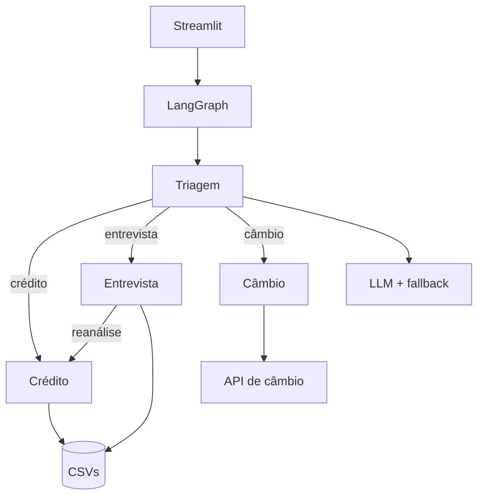

# Banco Ágil

[](https://github.com/guisefe/banco-agil-agent/actions/workflows/ci.yml)


Assistente bancário construído para o desafio técnico da Tech For Humans. A aplicação usa
Streamlit como interface e quatro agentes orquestrados com LangGraph: Triagem, Crédito,
Entrevista de Crédito e Câmbio.

A regra que orienta o projeto é simples: **a LLM entende a mensagem; o código decide**.
Autenticação, score, aprovação e escrita nos CSVs são determinísticos.

## Visão geral

Para o usuário existe uma conversa única. Internamente, cada agente tem um escopo:

| Agente | Responsabilidade |
| --- | --- |
| Triagem | Autenticar por CPF e nascimento e identificar o pedido. |
| Crédito | Consultar score/limite e avaliar aumento de limite. |
| Entrevista | Coletar os cinco dados financeiros e recalcular o score. |
| Câmbio | Consultar a cotação atual de uma moeda suportada. |

O usuário pode encerrar a conversa em qualquer etapa. Nenhum agente bancário é acessado antes
da autenticação, que permite no máximo três tentativas.

## Arquitetura



O estado tipado guarda a etapa atual, autenticação e dados temporários. O grafo executa os
handoffs sem expor nomes internos na interface. Os agentes dependem de contratos de
repositório; por isso, regra de negócio e acesso a arquivo ficam separados.

### Por que LangGraph?

O fluxo não é apenas pergunta e resposta. Há autenticação obrigatória, desvios, encerramento
global e um ciclo Entrevista → Crédito → reanálise. LangGraph deixa essas transições explícitas
e evita um bloco único de condicionais controlando toda a conversa. Além disso, permite manter
as regras nos agentes e usar o framework apenas para estado e roteamento.

### Por que Groq?

A Groq oferece um endpoint compatível com a API da OpenAI e baixa latência para a tarefa usada
aqui: classificação e extração estruturada. O código não depende do provedor; `LLM_BASE_URL`,
`LLM_API_KEY` e `LLM_MODEL` permitem trocar por outro endpoint compatível. A escolha foi feita
para a demonstração e não representa dependência permanente de fornecedor.

### Alternativas consideradas

O PDF permite escolher a stack e sugere diferentes frameworks e provedores. A comparação
abaixo registra a decisão tomada para este projeto, considerando um prazo de sete dias e um
fluxo bancário pequeno, mas com estados e regras obrigatórias.

| Alternativa | Por que não foi escolhida neste projeto |
| --- | --- |
| Google ADK | É uma opção válida para agentes integrados ao ecossistema Google, mas adicionaria uma abstração e um modelo operacional novos sem vantagem concreta para os quatro fluxos exigidos. |
| CrewAI | É voltado à colaboração mais autônoma entre agentes. Aqui os handoffs precisam seguir uma ordem previsível e auditável, não uma delegação aberta de tarefas. |
| LangChain | Oferece muitas integrações, porém o projeto precisa principalmente de máquina de estados. Usar LangChain junto do LangGraph aumentaria a superfície da solução sem necessidade. |
| LlamaIndex | É mais adequado quando recuperação e indexação de documentos são centrais. Este desafio trabalha com CSVs pequenos, regras locais e uma API de cotação, sem RAG. |
| Código sem framework | Seria possível implementar o fluxo manualmente, mas autenticação, desvios, encerramento global e reanálise deixariam o roteamento mais espalhado e difícil de visualizar. |

Para a LLM, Gemini, OpenAI e Together AI atenderiam à classificação estruturada. Groq foi
escolhida pela baixa latência e pelo acesso simples para demonstração. Como a chamada utiliza
um contrato HTTP compatível com OpenAI, a troca de provedor depende de configuração, não de
reescrever os agentes.

Na cotação, Tavily e SerpAPI também aparecem como exemplos no PDF, mas são ferramentas de
busca genérica. A AwesomeAPI foi preferida por oferecer um endpoint específico para pares de
moedas, com payload menor e validação mais simples. Streamlit não foi comparado com outras UIs
porque é um requisito explícito da entrega.

### Onde a LLM participa

Depois da autenticação, a LLM recebe a mensagem e devolve JSON com:

- intenção dentro de uma lista fechada;
- moeda, quando o pedido é de câmbio;
- novo limite total, quando informado pelo cliente.

Assim, uma frase como “preciso de um fôlego de quatro mil no cartão” pode ser entendida e
avaliada no mesmo turno. A saída passa por validação antes de entrar no estado. Timeout, falha
HTTP ou JSON inválido acionam o classificador local.

A LLM não recebe CPF ou data de nascimento: esses padrões são substituídos antes da chamada.
Ela também não participa da entrevista financeira, não calcula score e não aprova crédito.
Quando habilitada, o texto do pedido — inclusive um valor citado — é enviado ao provedor; essa
é uma limitação conhecida deste MVP.

## Regras de crédito

O limite é decidido pela faixa do cliente em `score_limite.csv`. Um cliente sem score não é
tratado como score zero e não recebe uma decisão automática: o pedido fica pendente e a
entrevista é oferecida. Ao final, o score é atualizado e o mesmo pedido é reanalisado.

A fórmula da entrevista segue o exemplo do desafio:

```text
(renda / (despesas + 1)) * peso_renda
+ peso_emprego
+ peso_dependentes
+ peso_dividas
```

O resultado é arredondado e limitado ao intervalo de 0 a 1000. Portanto, o peso negativo de
uma dívida pode reduzir o cálculo, mas o score armazenado nunca é negativo.

Valores monetários usam `Decimal`. Aprovação e registro envolvem dois CSVs; como não há uma
transação real entre arquivos, a aplicação usa escrita atômica por substituição, seção crítica
e compensação quando a segunda operação falha.

## Dados

Os nomes abaixo foram mantidos porque fazem parte da especificação do desafio:

| Arquivo | Uso |
| --- | --- |
| `clientes.csv` | CPF, nome, nascimento, limite atual e score. |
| `score_limite.csv` | Faixas de score e limite máximo permitido. |
| `solicitacoes_aumento_limite.csv` | Histórico de pedidos, horário e resultado. |

Os dados incluídos são fictícios. A trilha JSONL registra eventos e motivos, sem copiar CPF,
nascimento, score, renda ou texto completo da conversa. Detalhes e limitações estão em
[Privacidade e Auditoria](docs/PRIVACY_AND_AUDIT.md).

## Funcionalidades

- autenticação por CPF e data de nascimento;
- encerramento após três falhas de autenticação;
- consulta de score e limite;
- aumento de limite com política reproduzível;
- tratamento específico para cliente sem score;
- entrevista com renda, emprego, despesas, dependentes e dívidas;
- reanálise automática do pedido original;
- cotação de USD, EUR, ARS, GBP e JPY;
- encerramento em qualquer agente;
- fallback local quando a LLM está ausente ou indisponível.

## Estrutura

```text
app/
├── agents/        # quatro agentes do desafio
├── graph/         # estado e transições LangGraph
├── services/      # interpretação por LLM e fallback
├── repositories/  # CSVs e API de câmbio
├── models/        # tipos e regras de domínio
├── tools/         # CPF, dinheiro e encerramento
├── audit/         # eventos e persistência JSONL
└── ui/            # interface Streamlit
tests/             # testes essenciais de unidade, integração e fluxo
data/              # dados fictícios da demonstração
```

## Execução

Requisitos: Python 3.12 e [uv](https://docs.astral.sh/uv/).

```bash
git clone https://github.com/guisefe/banco-agil-agent.git
cd banco-agil-agent
unset VIRTUAL_ENV
uv sync --locked --dev
uv run streamlit run streamlit_app.py
```

O `unset VIRTUAL_ENV` evita que um ambiente virtual herdado do Codespace seja confundido com
o `.venv` criado pelo `uv`.

Abra `http://localhost:8501`. A aplicação funciona sem chave, usando o fallback local.

Para ativar a LLM:

```bash
export GROQ_API_KEY="sua-chave"
export LLM_MODEL="openai/gpt-oss-20b"
uv run streamlit run streamlit_app.py
```

As variáveis equivalentes `LLM_API_KEY` e `LLM_BASE_URL` permitem outro provedor compatível.
As variáveis precisam ser exportadas **antes** de iniciar o Streamlit. Depois de alterar a
chave, interrompa o servidor com `Ctrl+C` e execute-o novamente; o botão “Nova conversa” não
recarrega variáveis do processo. O arquivo `.env.example` é apenas uma referência e não é
carregado automaticamente.

A barra lateral mostra o estado da integração:

- `LLM configurada — aguardando mensagem`: a chave foi encontrada, mas ainda não houve chamada;
- `LLM ativa`: a última intenção foi interpretada pelo modelo;
- `LLM falhou — fallback ativo`: a chamada falhou e o classificador local assumiu o turno;
- `fallback local`: nenhuma chave foi encontrada ao iniciar a aplicação.

## Testes

```bash
uv run ruff format --check .
uv run ruff check .
uv run mypy app tests
uv run pytest
```

A suíte tem 146 testes voltados aos fluxos e falhas que mudam o comportamento do sistema. A
CI exige cobertura mínima de 90%; o estado atual fica acima de 93%. O objetivo é proteger as
regras do desafio, não produzir casos repetidos para perseguir 100%.

### Roteiro manual curto

Use um dos perfis fictícios de `data/clientes.csv`.

1. Autentique com CPF e data de nascimento.
2. Pergunte “qual é meu score?” e depois “qual é meu limite?”.
3. Peça um aumento informando o novo limite na própria frase.
4. Teste um cliente sem score e conclua a entrevista.
5. Confirme que o pedido original é reanalisado sem digitar o valor novamente.
6. Peça a cotação do dólar.
7. Digite “encerrar” durante uma nova operação.

Os passos de crédito alteram os CSVs. Faça uma cópia de `data/` antes de repetir a
demonstração.

## Desafios e decisões

- **CSV em vez de banco:** exigência e proporção do desafio; repositórios isolam uma futura
  troca por armazenamento transacional.
- **LLM limitada:** melhora linguagem natural sem tornar decisões bancárias imprevisíveis.
- **Cliente sem score:** ausência de dado vira pedido pendente, nunca score negativo ou zero
  inventado.
- **Falhas externas:** LLM e câmbio têm timeout e mensagens controladas; o fluxo não exibe
  exceções técnicas ao cliente.
- **Consistência:** atualizações críticas são auditadas e compensadas quando uma etapa seguinte
  não pode ser concluída.

## Limites do MVP

Esta é uma demonstração local, não um sistema bancário de produção. CSV e JSONL não oferecem
transação distribuída, controle de acesso, retenção formal ou operação concorrente entre várias
instâncias. Em produção seriam necessários banco transacional, cofre de segredos, auditoria
centralizada, observabilidade, idempotência e revisão de segurança/LGPD.
