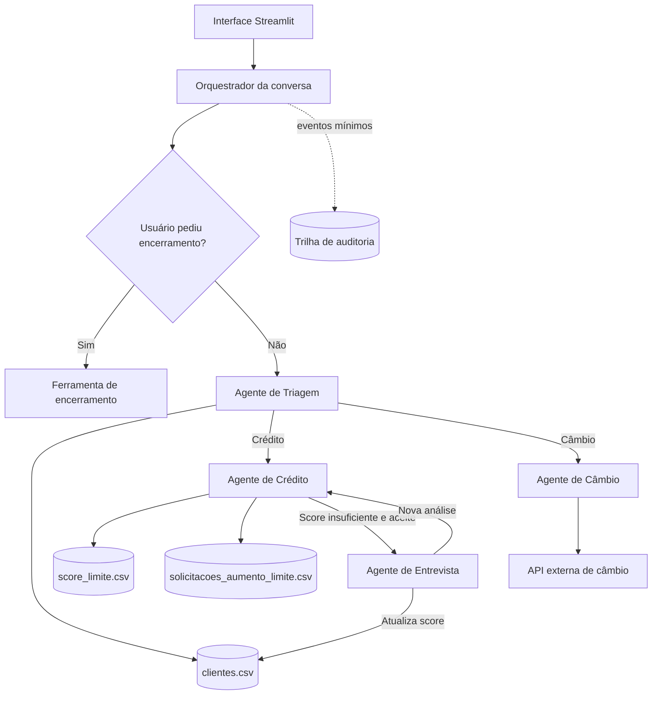

# Banco Ágil - Agente Bancário Inteligente

[](https://github.com/guisefe/banco-agil-agent/actions/workflows/ci.yml)


Sistema de atendimento bancário conversacional composto por agentes especializados. O
projeto foi desenvolvido para o desafio técnico da Tech For Humans e prioriza regras de
negócio determinísticas, separação de responsabilidades, testes automatizados,
rastreabilidade e proteção de dados pessoais.

> **Status atual:** fundação, Triagem, orquestração, interface Streamlit e Agente de
> Crédito concluídos. Entrevista de Crédito e Câmbio serão conectados incrementalmente e
> só serão marcados como concluídos após testes automatizados.

## Visão Geral do Projeto

Para o cliente, o Banco Ágil se comporta como um único assistente. Internamente, o
atendimento é dividido entre quatro agentes com escopos bem definidos:

| Agente | Responsabilidade |
| --- | --- |
| Triagem | Recepcionar, autenticar por CPF e nascimento e identificar a solicitação. |
| Crédito | Consultar limite e processar pedidos de aumento de crédito. |
| Entrevista de Crédito | Coletar informações financeiras e recalcular o score. |
| Câmbio | Consultar cotações atuais por meio de uma API externa. |

O usuário pode solicitar o encerramento a qualquer momento. As transições entre agentes
são implícitas, preservando a experiência de uma conversa única.

## Arquitetura do Sistema



### Componentes

- **Interface:** Streamlit oferece o chat usado para simular o atendimento incremental.
- **Orquestração:** um grafo de estados controlará turnos, autenticação, handoffs e
  encerramento.
- **Agentes:** cada agente poderá executar apenas ações pertencentes ao seu escopo.
- **Ferramentas:** autenticação, leitura e escrita de CSV, cálculo de score, consulta de
  câmbio e encerramento serão funções explícitas e testáveis.
- **Auditoria:** eventos de negócio serão registrados separadamente das mensagens e dos
  dados financeiros.

### Fluxo de autenticação

1. A Triagem solicita CPF e data de nascimento separadamente.
2. Os dados são comparados com `clientes.csv`.
3. Após uma autenticação válida, a intenção do cliente é identificada.
4. Em caso de falha, são permitidas mais duas tentativas.
5. A terceira falha consecutiva encerra o atendimento de maneira amigável.

Nenhum agente de Crédito, Entrevista ou Câmbio será acessado antes da autenticação.

### Manipulação dos dados

| Recurso | Operação | Finalidade |
| --- | --- | --- |
| `clientes.csv` | Leitura e atualização controlada | Autenticação, limite e score do cliente. |
| `score_limite.csv` | Somente leitura | Determinar o limite permitido para cada faixa de score. |
| `solicitacoes_aumento_limite.csv` | Escrita | Registrar solicitações com o esquema exigido pelo desafio. |
| API de câmbio | Consulta | Obter cotação atual da moeda solicitada. |
| Auditoria JSONL | Append-only no MVP | Registrar eventos técnicos e de negócio sem dados brutos. |

CPF e data de nascimento são utilizados no fluxo funcional exigido pelo desafio, mas não
são gravados na auditoria. Quando for necessário correlacionar eventos, o titular será
representado por uma referência pseudonimizada com HMAC-SHA-256. Veja as decisões e
limitações em [Privacidade e Auditoria](docs/PRIVACY_AND_AUDIT.md).

## Funcionalidades Implementadas

### Concluídas

- [x] Estado conversacional tipado e inicialização segura.
- [x] Identificador único por conversa.
- [x] Modelo imutável de eventos de auditoria.
- [x] Pseudonimização de referência do titular com HMAC-SHA-256.
- [x] Persistência local de auditoria em JSONL com acesso restrito.
- [x] Testes automatizados e cobertura mínima obrigatória de 80%.
- [x] CI com formatação, lint, tipagem e testes.
- [x] Dependabot para dependências Python/uv e GitHub Actions.
- [x] Validação de CPF e data de nascimento em `clientes.csv`.
- [x] Controle de até três tentativas consecutivas de autenticação.
- [x] Identificação determinística de intenção após autenticação.
- [x] Tratamento controlado de arquivo ausente, esquema inválido e registro duplicado.
- [x] Encerramento durante a Triagem com remoção dos dados pessoais do estado.
- [x] Orquestração dos turnos da Triagem com LangGraph.
- [x] Interface Streamlit com histórico sensível mascarado.
- [x] Composição explícita entre configurações, repositórios, auditoria, agente e grafo.
- [x] Consulta de limite após autenticação.
- [x] Solicitação de aumento com valores monetários tratados por `Decimal`.
- [x] Política determinística carregada de `score_limite.csv`.
- [x] Registro final em `solicitacoes_aumento_limite.csv` com timestamp UTC ISO 8601.
- [x] Atualização atômica do limite aprovado e rollback controlado em falha de registro.
- [x] Auditoria da decisão sem CPF, score ou valores financeiros.
- [x] Oferta e handoff para entrevista após rejeição.
- [x] Encerramento global, inclusive após handoff para Crédito.

### Roadmap do desafio

- [x] Núcleo do Agente de Triagem e autenticação com até três tentativas.
- [x] Roteamento autenticado e encerramento global.
- [x] Agente de Crédito e consulta de limite.
- [x] Solicitação e decisão de aumento de limite.
- [ ] Agente de Entrevista e recálculo de score entre 0 e 1000.
- [ ] Agente de Câmbio com API externa e tratamento de indisponibilidade.
- [x] Interface conversacional inicial com Streamlit.
- [ ] Testes de integração do atendimento completo.

## Estrutura do Código

```text
app/
├── agents/          # Comportamento e escopo de cada agente
├── audit/           # Eventos, pseudonimização e persistência de auditoria
├── models/          # Estado e tipos compartilhados da conversa
├── repositories/    # Clientes, política de score e solicitações em CSV
├── tools/           # Identidade, valores monetários e encerramento
├── graph/           # Orquestração e roteamento entre agentes disponíveis
└── ui/              # Interface Streamlit e proteção de dados exibidos
tests/               # Testes unitários e de integração
docs/                # Decisões de arquitetura, privacidade e operação
```

Os diretórios marcados como planejados serão criados apenas quando sua primeira
responsabilidade for implementada, evitando módulos vazios e abstrações prematuras.

## Desafios Enfrentados e Como Foram Resolvidos

### Rastreabilidade sem expor dados pessoais

Registrar conversas completas facilitaria a depuração, mas aumentaria a exposição de CPF,
nascimento e informações financeiras. A solução foi auditar eventos mínimos, motivos
controlados e versões das regras. A referência do titular é pseudonimizada e a chave não é
armazenada no Git.

### Decisões de crédito explicáveis

Uma LLM não será responsável por aprovar crédito ou calcular score. As decisões serão
determinísticas e registrarão `reason_code` e `policy_version`, permitindo reprodução,
teste e revisão.

### Confiabilidade desde o início

O limite mínimo de cobertura inicialmente falhava porque ainda não havia testes. Foram
adicionados testes unitários para estado e auditoria, além de um pipeline que impede a
integração de código sem formatação, lint, tipagem e testes aprovados.

### Consistência entre pedido e limite aprovado

Os CSVs exigidos não oferecem transações entre arquivos. No MVP de processo único, a
decisão completa é serializada para sempre validar o pedido contra o limite mais recente.
A atualização do cliente usa substituição atômica e o caso de falha ao registrar uma
aprovação restaura o limite anterior. Em produção, os dois registros pertenceriam à mesma
transação em um banco de dados e teriam chave de idempotência.

### Estado atual versus arquitetura final

O README diferencia funcionalidades concluídas de itens planejados. Isso mantém a
documentação honesta durante o desenvolvimento incremental e evita afirmar que um agente
está pronto antes de seus testes.

## Escolhas Técnicas e Justificativas

| Escolha | Justificativa |
| --- | --- |
| Python 3.12 | Tipagem moderna, ecossistema de IA e compatibilidade com o desafio. |
| `uv` | Instalação rápida e ambiente reproduzível por meio de `uv.lock`. |
| Estado tipado | Torna transições explícitas e reduz erros entre agentes. |
| Regras determinísticas | Garante autenticação, score e crédito reproduzíveis e testáveis. |
| Grafo de estados | Representa os handoffs e impede que agentes atuem fora do escopo. |
| Streamlit | Permite construir rapidamente a UI simples solicitada no desafio. |
| CSV por repositórios/ferramentas | Cumpre a especificação sem acoplar os agentes ao armazenamento. |
| Auditoria estruturada | Oferece rastreabilidade sem armazenar o conteúdo completo da conversa. |
| Pytest, Ruff e MyPy | Automatizam testes, padronização e verificação estática. |
| GitHub Actions | Executa os mesmos controles em toda PR e na branch principal. |

A LLM será usada apenas onde a linguagem natural for útil, como identificação ambígua de
intenção e formulação de respostas. Regras críticas continuarão fora do modelo.

## Tutorial de Execução e Testes

### Pré-requisitos

- Python 3.12 ou superior;
- [uv](https://docs.astral.sh/uv/);
- Git.

### Preparação do ambiente

```bash
git clone https://github.com/guisefe/banco-agil-agent.git
cd banco-agil-agent
uv sync --locked --dev
```

Para manter uma referência de auditoria estável entre reinicializações, configure uma
chave secreta de pelo menos 32 bytes. Sem ela, a demonstração gera uma chave efêmera segura
por processo:

```bash
export AUDIT_PSEUDONYMIZATION_KEY="substitua-por-um-segredo-com-32-bytes-ou-mais"
```

### Testes e qualidade

```bash
uv run ruff format --check .
uv run ruff check .
uv run mypy app
uv run pytest
```

O `pytest` mede a cobertura do pacote `app` e falha quando o total fica abaixo de 80%.
Esses mesmos comandos são executados automaticamente pelo GitHub Actions.

### Executar a aplicação

```bash
uv run streamlit run streamlit_app.py
```

Use um dos clientes fictícios para testar a Triagem:

| CPF | Nascimento |
| --- | --- |
| `000.000.000-00` | `20/05/1990` |
| `111.111.111-11` | `03/11/1985` |

Depois da autenticação, escolha crédito e consulte o limite ou solicite um aumento. Para o
cliente com score 650, `R$ 5.000,00` é aprovado e um valor superior é rejeitado, oferecendo
o handoff para a entrevista. Os módulos ainda indisponíveis bloqueiam novas mensagens sem
revelar a transição interna. Nenhuma chave real deve ser adicionada ao repositório.

## Segurança e Privacidade

Este é um projeto educacional com dados fictícios. As medidas implementadas são alinhadas
a princípios de segurança e proteção de dados, mas não constituem certificação de
conformidade legal para uso bancário em produção.

Consulte [docs/PRIVACY_AND_AUDIT.md](docs/PRIVACY_AND_AUDIT.md) para conhecer o contrato de
minimização, as limitações do JSONL, os requisitos de produção e as referências oficiais.
