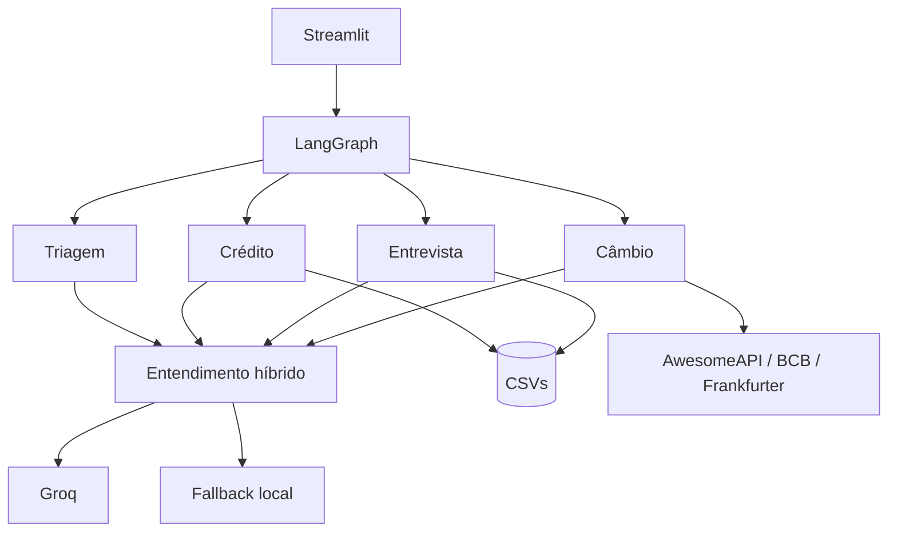

# Banco Ágil

[](https://github.com/guisefe/banco-agil-agent/actions/workflows/ci.yml)

[](https://github.com/langchain-ai/langgraph)
[](https://streamlit.io/)


Sistema conversacional multiagente para atendimento bancário, com uma interface única e quatro
especialidades internas: Triagem, Crédito, Entrevista de Crédito e Câmbio. O LangGraph coordena
estado e handoffs; a Groq interpreta linguagem natural; regras determinísticas em Python
controlam autenticação, score, decisões de crédito, persistência e auditoria.

> **A LLM entende a mensagem; o domínio toma a decisão.** Nenhuma aprovação, autenticação ou
> atualização financeira depende de texto gerado pelo modelo.

## Visão geral

O projeto implementa um atendimento completo do primeiro contato ao encerramento, preservando
uma separação explícita entre experiência conversacional e regra bancária.

| Capacidade | Garantia implementada |
| --- | --- |
| Orquestração | Exatamente quatro agentes, estado tipado e handoffs invisíveis ao cliente. |
| Autenticação | CPF + nascimento, no máximo três tentativas e nenhum roteamento anterior à validação. |
| Crédito | Consulta e ajuste de limite com política reproduzível carregada de CSV. |
| Entrevista | Cinco respostas estruturadas, score entre 0 e 1000 e reanálise automática. |
| Câmbio | Cotação com cadeia de provedores, timeout, retry e falha controlada. |
| Linguagem natural | Groq com JSON Schema estrito e fallback determinístico. |
| Segurança | Segredos externos, dados sintéticos, mascaramento na UI e auditoria pseudonimizada. |
| Qualidade | Ruff, MyPy estrito, Pytest com cobertura mínima e container validado na CI. |

## Executar localmente

Requisitos: Python 3.12 e [uv](https://docs.astral.sh/uv/).

```bash
git clone https://github.com/guisefe/banco-agil-agent.git
cd banco-agil-agent
cp .env.example .env
unset VIRTUAL_ENV
uv sync --locked --dev
uv run streamlit run streamlit_app.py
```

Acesse `http://localhost:8501`. Se o repositório já estiver clonado, use a pasta existente; não
crie uma segunda cópia dentro dela.

### Configurar a LLM

Adicione uma chave válida ao `.env`:

```dotenv
GROQ_API_KEY=sua-chave-groq
LLM_MODEL=openai/gpt-oss-20b
```

Reinicie o Streamlit depois de alterar o arquivo. A barra lateral deixa o modo efetivamente
usado no último turno visível:

- `LLM ativa`: a Groq interpretou a mensagem;
- `LLM falhou — fallback ativo`: timeout, erro HTTP ou saída inválida acionou o fallback;
- `fallback local`: nenhuma chave foi configurada;
- `LLM configurada — aguardando mensagem`: a chave foi carregada, mas ainda não houve chamada.

Sem chave, a aplicação continua funcional para contingência, mas não demonstra a integração
com a LLM.

### Configurar cotação em tempo real

`EXCHANGE_API_KEY` habilita a AwesomeAPI como primeira fonte. Sem a chave, a aplicação utiliza
a PTAX do Banco Central e, se necessário, a taxa diária de referência da Frankfurter.

## Dados de demonstração

Todos os registros são sintéticos e existem apenas para exercitar regras distintas.

| Cliente | CPF | Nascimento | Cenário principal |
| --- | --- | --- | --- |
| Ana Martins | `00000000000` | `20/05/1990` | Consultar score/limite e testar aumento ou redução. |
| Mariana Souza | `22222222222` | `14/02/1995` | Cliente sem score e encaminhamento para entrevista. |
| João Pereira | `33333333333` | `08/09/1978` | Score baixo e possível rejeição. |
| Rafael Lima | `77777777777` | `11/07/1992` | Fronteira inicial da faixa de score `300`. |
| Diego Nascimento | `99999999999` | `05/01/2002` | Personalização e score máximo `1000`. |

Operações de crédito alteram os CSVs. Preserve uma cópia de `data/` quando precisar repetir a
mesma demonstração desde o estado inicial.

## Arquitetura



O grafo mantém o estado da sessão, controla transições e encerra qualquer fluxo de forma
uniforme. Os agentes concentram a interação; modelos representam o domínio; serviços tratam
linguagem; repositórios isolam arquivos e APIs. Isso permite testar regras críticas sem rede e
substituir infraestrutura sem reescrever o fluxo bancário.

### Responsabilidades dos agentes

| Agente | Responsabilidade | Saída principal |
| --- | --- | --- |
| Triagem | Ativar a sessão, autenticar e identificar o assunto somente após a identidade ser confirmada. | Handoff para Crédito, Entrevista ou Câmbio. |
| Crédito | Consultar score/limite e processar aumento, redução ou manutenção do limite. | Decisão persistida ou oferta de entrevista. |
| Entrevista | Coletar renda, emprego, despesas, dependentes e dívidas. | Novo score e retorno para reanálise. |
| Câmbio | Identificar uma moeda suportada e buscar sua cotação em reais. | Cotação contextualizada e retorno à Triagem. |

O cliente permanece em uma única interface e não precisa conhecer os handoffs internos.

### Fluxo de autenticação e roteamento

1. A interface abre sem iniciar uma conversa automaticamente.
2. A primeira mensagem ativa a Triagem e recebe uma saudação com solicitação de CPF.
3. O agente coleta a data de nascimento e valida a identidade no `clientes.csv`.
4. Após sucesso, o atendimento usa o primeiro nome do cliente e retoma o pedido inicial.
5. Somente então a LLM ou o fallback identifica o assunto e o LangGraph executa o handoff.

Pedidos enviados na primeira mensagem são mantidos temporariamente sem classificação. CPF não
cadastrado recebe confirmação, possibilidade de correção e orientação antes do encerramento.
CPF existente com nascimento incompatível segue o limite independente de três tentativas.

Essa ordem preserva o contrato vinculante: saudação, CPF, nascimento, autenticação,
identificação do assunto e redirecionamento.

### Fronteira entre LLM e regras de negócio

| Responsabilidade | Implementação |
| --- | --- |
| Intenção e entidades em linguagem livre | Groq preferencialmente; fallback local em contingência. |
| Autenticação e limite de tentativas | Python + repositório de clientes. |
| Score e decisão de crédito | Fórmula e política determinísticas. |
| Valores monetários | `Decimal`, sem decisão baseada em `float`. |
| Persistência e compensação | Repositórios CSV sob seção crítica. |
| Auditoria e pseudonimização | Eventos tipados + HMAC-SHA-256. |

A Groq recebe apenas a mensagem corrente depois da autenticação, limitada a 1.000 caracteres.
CPF e padrões de nascimento são substituídos antes da chamada. Nome, score, limite atual,
perfil armazenado, política e histórico completo não entram no prompt.

O modelo classifica uma intenção fechada e normaliza campos esperados. A resposta usa JSON
Schema estrito e passa por nova validação de domínio. Há duas tentativas para falhas transitórias;
timeout, erro HTTP, JSON inválido ou valor inconsistente ativam o fallback determinístico.

## Fluxos de negócio

### Crédito

`score_limite.csv` define o limite máximo permitido em cada faixa. O LLM não participa da
aprovação. Um cliente sem score não é tratado como score zero: a análise fica pendente, a
entrevista é oferecida e o valor originalmente solicitado é reanalisado após o recálculo.

“Ajustar limite” é a operação apresentada ao cliente:

- aumento: passa pela política de score e gera uma solicitação auditável;
- redução: exige confirmação explícita e não cria uma falsa solicitação de aumento;
- valor igual ao atual: informa que nenhuma alteração é necessária.

Escritas usam arquivo temporário, substituição atômica e seção crítica. Quando a atualização do
cliente e o histórico da solicitação não podem ser concluídos em conjunto, o fluxo aplica
compensação para evitar uma aprovação parcialmente persistida.

### Entrevista de crédito

O score é calculado a partir de renda mensal, tipo de emprego, despesas fixas, dependentes e
dívidas ativas:

```text
(renda / (despesas + 1)) * peso_renda
+ peso_emprego
+ peso_dependentes
+ peso_dividas
```

O resultado usa arredondamento explícito e é limitado ao intervalo de 0 a 1000. Valores
financeiros usam `Decimal`; respostas financeiras são removidas do estado ao concluir ou
encerrar. Após a atualização, o grafo retorna ao Crédito e reanalisa o pedido pendente sem pedir
o valor novamente.

### Câmbio

A consulta suporta USD, EUR, ARS, GBP e JPY. A cadeia de provedores é:

1. AwesomeAPI, quando `EXCHANGE_API_KEY` está configurada;
2. última PTAX disponível na API oficial do Banco Central;
3. taxa diária de referência da Frankfurter.

A resposta identifica quando o valor é compra/venda ou apenas taxa de referência. Timeout,
payload inválido e indisponibilidade são tratados sem interromper abruptamente a sessão.

## Escolhas técnicas e justificativas

| Escolha | Justificativa | Trade-off assumido |
| --- | --- | --- |
| LangGraph | Autenticação, handoffs, encerramento global e o ciclo Entrevista → Crédito formam uma máquina de estados explícita. | Mais estrutura que condicionais simples, em troca de transições rastreáveis e testáveis. |
| Groq | Baixa latência, JSON Schema no modelo configurado e endpoint compatível com OpenAI. | Dependência de rede e fornecedor, mitigada por timeout, retry e fallback. |
| Arquitetura híbrida | A LLM absorve variações de linguagem; o domínio preserva decisões reproduzíveis. | O fallback entende menos formulações, mas mantém o caminho crítico disponível. |
| Repositórios sobre CSV | Os arquivos fazem parte do contrato da solução e ficam isolados das regras. | CSV não substitui um banco transacional multi-instância. |
| Streamlit | Atende à interface exigida e permite demonstrar o fluxo completo com pouca infraestrutura. | Sessão local e processo único são adequados ao MVP, não à operação bancária real. |
| AwesomeAPI + BCB + Frankfurter | Combina tempo real opcional, referência oficial brasileira e contingência sem chave. | Fontes têm semânticas distintas; a resposta precisa informar qual taxa está exibindo. |

CrewAI foi descartado porque privilegia colaboração mais autônoma, enquanto este atendimento
exige ordem previsível. LlamaIndex seria apropriado para RAG, que não faz parte do domínio.
LangChain ampliaria a superfície sem substituir a máquina de estados. Google ADK é uma opção
válida, mas introduziria outro modelo operacional sem benefício proporcional neste fluxo.
Tavily e SerpAPI são mecanismos de busca geral; APIs cambiais oferecem contratos menores e mais
fáceis de validar para este caso.

## Desafios enfrentados e como foram resolvidos

| Desafio | Risco técnico | Solução |
| --- | --- | --- |
| Preservar autenticação antes do entendimento | Interpretar o pedido cedo demais violaria a ordem do atendimento. | O pedido inicial fica pendente e só é classificado após CPF + nascimento. |
| Entender linguagem natural sem terceirizar decisões | Uma resposta probabilística poderia alterar autenticação ou crédito. | LLM restrita a intenção/extração; regras críticas permanecem determinísticas. |
| Diferenciar score ausente de score zero | Tratar ausência como zero produziria uma decisão incorreta. | `None` suspende a análise e oferece entrevista; zero continua sendo um score válido. |
| Manter consistência entre arquivos | CSVs não oferecem transação distribuída. | Lock, substituição atômica e compensação em falhas parciais. |
| Conviver com serviços externos instáveis | Falhas da LLM ou cotação poderiam travar o atendimento. | Timeout, retry, fallback encadeado e mensagens de erro controladas. |
| Encerrar com naturalidade em qualquer agente | Uma negativa curta podia ser confundida com intenção desconhecida. | Estado de confirmação de encerramento e ferramenta global de finalização. |
| Auditar sem copiar dados sensíveis | Logs completos aumentariam exposição de identidade e finanças. | Eventos estruturados, reason codes fechados, minimização e HMAC. |

## Dados, auditoria e privacidade

| Arquivo | Responsabilidade |
| --- | --- |
| `data/clientes.csv` | Identidade sintética, limite atual e score opcional. |
| `data/score_limite.csv` | Cinco faixas completas de score e seus limites máximos. |
| `data/solicitacoes_aumento_limite.csv` | Histórico gerado de solicitações e resultado. |
| `data/audit_events.jsonl` | Trilha local de eventos; criada em execução e ignorada pelo Git. |

O CSV de clientes mantém cinco cenários representativos. A política particiona todo o intervalo
de 0 a 1000 sem lacunas ou sobreposição. O histórico de solicitações começa apenas com o
cabeçalho porque é uma saída do sistema.

A auditoria registra identificadores de evento, horário UTC, agente, resultado, reason code,
versão da política e referência pseudonimizada. Não registra CPF, nascimento, nome, score,
renda, despesas, dívidas, valores solicitados, mensagens, prompts, respostas do modelo ou
segredos. HMAC reduz exposição, mas continua sendo pseudonimização, não anonimização.

A distinção explícita de CPF não cadastrado existe para demonstrar o fluxo solicitado. Em um
produto real, essa mensagem precisaria de análise contra enumeração de clientes e poderia ser
substituída por uma resposta genérica ou por confirmação em canal autenticado.

O contrato detalhado está em [Privacidade e auditoria](docs/PRIVACY_AND_AUDIT.md).

## Estrutura do projeto

```text
app/
├── agents/        # quatro agentes e suas interações
├── graph/         # estado e transições LangGraph
├── services/      # entendimento híbrido da conversa
├── repositories/  # persistência CSV e APIs externas
├── models/        # tipos e invariantes de domínio
├── tools/         # CPF, dinheiro e encerramento
├── audit/         # eventos e persistência JSONL
└── ui/            # interface Streamlit
tests/             # domínio, repositórios, agentes, grafo e interface
data/              # fixtures sintéticas e política de crédito
docs/              # decisões complementares de privacidade e auditoria
```

## Execução e testes

### Gates locais

```bash
uv run ruff format --check .
uv run ruff check .
uv run mypy app tests
uv run pytest
```

A CI executa os mesmos gates, exige ao menos 90% de cobertura total com medição de branches e
valida o build e o health check do container. Dependências são resolvidas pelo `uv.lock`; ações
da CI usam referências imutáveis; o container executa com usuário sem privilégios.

### Roteiro funcional principal

1. Envie “Olá” e confirme que a Triagem solicita CPF apenas depois dessa interação.
2. Autentique-se como Diego e confirme a personalização pelo primeiro nome.
3. Em uma nova conversa, envie “qual é meu limite?” antes de autenticar como Ana; o pedido deve
   ser retomado sem repetição.
4. Consulte o score e escreva “preciso de um fôlego de quatro mil no cartão”.
5. Confirme `LLM ativa` na barra lateral e observe a decisão determinística.
6. Peça um limite menor que o atual, confirme a redução e consulte o limite novamente.
7. Autentique-se como Mariana, solicite aumento e conclua a entrevista em linguagem natural.
8. Confirme a reanálise automática do pedido original.
9. Solicite a cotação da moeda dos Estados Unidos.
10. Recuse outro serviço e confirme o encerramento solicitado pelo assistente.

Para testar CPF não cadastrado, use `12345678901` e uma data válida. Responda “não” para
corrigir ou “sim, está correto” para receber orientação e encerrar. Para testar o limite de
autenticação, use um CPF cadastrado e uma data incompatível, como `01/01/2000`, três vezes.
Erros de formato são corrigidos antes da consulta e não consomem uma tentativa de identidade.

Groq e provedores cambiais são confirmados manualmente porque dependem de credenciais, rede e
disponibilidade externa; seus contratos HTTP são simulados na suíte automatizada.

### Container

```bash
docker build -t banco-agil-agent .
docker run --rm -p 8501:8501 --env-file .env banco-agil-agent
```

## Solução de problemas

**`No module named streamlit` ou `streamlit_app.py` ausente**

Confirme que o terminal está na raiz do repositório e atualize a `main` antes de sincronizar as
dependências. Se `VIRTUAL_ENV` apontar para outro projeto, execute `unset VIRTUAL_ENV`.

**A barra mostra `fallback local`**

Confirme `GROQ_API_KEY` no `.env` e reinicie o processo. Se mostrar `LLM falhou`, consulte o
terminal: a aplicação registra apenas o tipo/status da falha, sem mensagem do cliente ou chave.

**A cotação não retorna**

Verifique acesso HTTPS ao BCB e à Frankfurter. Para AwesomeAPI, confirme `EXCHANGE_API_KEY`.
O terminal identifica o provedor indisponível sem registrar a mensagem ou os dados do cliente.

## Limites e evolução para produção

Este repositório entrega um MVP local completo, não uma plataforma bancária pronta para operar
com dados reais. CSV e JSONL não oferecem transações multi-instância, controle de acesso
corporativo, retenção automatizada ou auditoria imutável.

Uma implantação de produção exigiria banco transacional, cofre de segredos, idempotência,
telemetria centralizada, criptografia gerenciada, autenticação forte, políticas de acesso e
retenção, revisão humana de decisões contestadas e validação formal de segurança, LGPD e regras
regulatórias aplicáveis.
