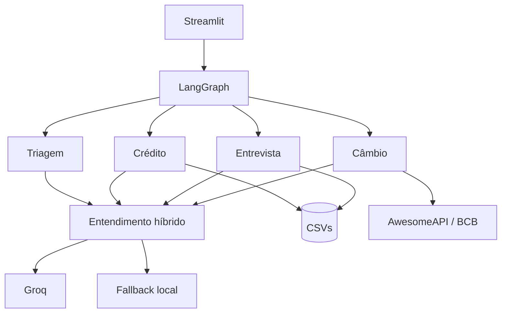

# Banco Ágil

[](https://github.com/guisefe/banco-agil-agent/actions/workflows/ci.yml)


Assistente bancário desenvolvido para o desafio técnico da Tech For Humans. O cliente conversa
por uma única interface Streamlit; internamente, quatro agentes LangGraph cuidam de Triagem,
Crédito, Entrevista de Crédito e Câmbio.

> **A LLM entende a mensagem; o código aplica as regras.** Autenticação, score, aprovação,
> persistência e auditoria nunca dependem da resposta do modelo.

## Executar em 5 minutos

Requisitos: Python 3.12 e [uv](https://docs.astral.sh/uv/).

```bash
git clone https://github.com/guisefe/banco-agil-agent.git
cd banco-agil-agent
cp .env.example .env
unset VIRTUAL_ENV
uv sync --locked --dev
uv run streamlit run streamlit_app.py
```

Abra `http://localhost:8501`. Se a pasta já existir, entre nela e comece em
`cp .env.example .env`; não faça outro clone dentro do primeiro.

### Ativar a LLM

Edite `.env` e informe sua chave:

```dotenv
GROQ_API_KEY=sua-chave-groq
LLM_MODEL=openai/gpt-oss-20b
```

O arquivo é carregado automaticamente. Depois de alterar a chave, pare o Streamlit com
`Ctrl+C` e inicie novamente. Sem chave, a aplicação continua disponível, mas usa somente o
fallback local — esse modo não demonstra a integração com LLM.

A barra lateral informa o que aconteceu no último turno:

- `LLM ativa`: a Groq interpretou a mensagem;
- `LLM falhou — fallback ativo`: houve timeout, erro HTTP ou saída inválida;
- `fallback local`: nenhuma chave foi configurada;
- `LLM configurada — aguardando mensagem`: a chave foi lida, mas ainda não houve chamada.

### Dados fictícios para demonstração

| Cenário | CPF | Nascimento | Uso sugerido |
| --- | --- | --- | --- |
| Ana Martins | `00000000000` | `20/05/1990` | Consultar score/limite e pedir aumento. |
| Mariana Souza | `22222222222` | `14/02/1995` | Testar cliente sem score e entrevista. |

Os identificadores são fixtures sintéticas do desafio, não CPFs reais.

### Roteiro manual principal

1. Entre como Ana e pergunte “qual é meu score?” e “qual é meu limite?”.
2. Escreva “preciso de um fôlego de quatro mil no cartão”.
3. Confirme `LLM ativa` na barra lateral e veja a decisão determinística de crédito.
4. Inicie outra conversa como Mariana e solicite um aumento.
5. Conclua a entrevista com respostas naturais, como “trabalho registrado” e “não tenho
   dívidas”.
6. Confirme que o pedido original é reanalisado sem redigitar o valor.
7. Peça “quanto está a moeda dos Estados Unidos?”.
8. Digite “encerrar” durante uma nova operação.

Crédito altera os CSVs. Faça uma cópia de `data/` antes de repetir a demonstração.

## Funcionalidades entregues

| Agente | Responsabilidade |
| --- | --- |
| Triagem | Autentica por CPF + nascimento, limita a três tentativas e identifica o pedido. |
| Crédito | Consulta score/limite e decide aumento pela política do CSV. |
| Entrevista | Coleta cinco dados financeiros, recalcula o score e retorna para reanálise. |
| Câmbio | Consulta USD, EUR, ARS, GBP ou JPY e retorna à Triagem. |

O usuário pode encerrar a conversa em qualquer etapa. Os handoffs são internos e nenhum agente
bancário é acessado antes da autenticação.

## Arquitetura



O grafo guarda estado, autenticação e etapa atual. Os agentes concentram a conversa; modelos e
serviços aplicam as regras; repositórios isolam CSVs e APIs externas. Essa separação permite
testar o fluxo sem depender da rede nem misturar decisão bancária com geração de texto.

### Participação da LLM

A Groq recebe apenas a mensagem do turno atual, após autenticação, para:

- classificar intenção dentro de uma lista fechada;
- extrair moeda e novo limite solicitado;
- normalizar renda, emprego, despesas, dependentes e respostas sim/não.

A API devolve JSON Schema estrito, validado novamente pelo domínio. Há duas tentativas para
falhas transitórias; depois disso, o fallback local mantém o atendimento. CPF e nascimento são
substituídos antes do envio. Nome, score, limite atual, perfil armazenado, política de crédito e
histórico da conversa não entram no prompt.

### Fluxo de crédito

`score_limite.csv` define o limite máximo de cada faixa. Um cliente sem score não é tratado
como zero e não recebe crédito automaticamente: a solicitação fica pendente, a entrevista é
oferecida e o mesmo valor é reanalisado após a atualização.

```text
(renda / (despesas + 1)) * peso_renda
+ peso_emprego
+ peso_dependentes
+ peso_dividas
```

O resultado é arredondado e limitado entre 0 e 1000; score negativo não é persistido. Valores
monetários usam `Decimal`. Escritas usam arquivo temporário + substituição, seção crítica e
compensação quando a atualização do limite e o registro da solicitação não podem ser concluídos
juntos.

### Fluxo de câmbio

- Com `EXCHANGE_API_KEY`, a AwesomeAPI fornece a cotação em tempo real.
- Se ela estiver ausente ou falhar, o sistema consulta a última PTAX disponível na API oficial
  do Banco Central do Brasil.
- Se o BCB estiver temporariamente inacessível, uma taxa diária de referência da Frankfurter
  mantém o fluxo disponível sem exigir outra chave. Nesse caso, a interface não chama o valor
  de compra/venda, pois se trata de uma taxa de referência.
- Timeout, resposta inválida e indisponibilidade produzem mensagem controlada, sem travar a
  sessão.

## Decisões técnicas

| Escolha | Motivo |
| --- | --- |
| LangGraph | O fluxo tem autenticação obrigatória, handoffs, encerramento global e ciclo Entrevista → Crédito; um grafo explicita essas transições. |
| Groq | Baixa latência, modelo de produção com JSON Schema e endpoint compatível com OpenAI. O provedor pode ser trocado por configuração. |
| Interpretação híbrida | Linguagem livre passa pela LLM; regras críticas permanecem reproduzíveis e há fallback local. |
| AwesomeAPI + BCB + Frankfurter | A primeira atende tempo real; a PTAX oficial é a referência brasileira; a terceira reduz indisponibilidade sem outra chave. |
| CSV | É parte do desafio e suficiente para um MVP local. Repositórios mantêm aberta a troca por banco transacional. |
| Streamlit | É requisito da entrega e permite demonstrar o atendimento completo com pouca infraestrutura. |

Alternativas do PDF também foram avaliadas: CrewAI privilegia colaboração autônoma, enquanto
este fluxo exige ordem previsível; LlamaIndex seria útil para RAG, que não existe aqui;
LangChain ampliaria a superfície sem substituir a máquina de estados; Google ADK é válido, mas
introduziria outro modelo operacional para um fluxo pequeno. Tavily e SerpAPI são mecanismos de
busca geral; APIs cambiais têm contrato menor e mais simples de validar.

## Dados e auditoria

| Arquivo | Uso |
| --- | --- |
| `data/clientes.csv` | Identidade fictícia, limite atual e score opcional. |
| `data/score_limite.csv` | Faixas de score e limite máximo. |
| `data/solicitacoes_aumento_limite.csv` | Histórico de solicitações e resultado. |

A trilha JSONL registra evento, resultado, motivo e versão da política. Não copia CPF,
nascimento, score, renda, valores ou conversa completa. HMAC pseudonimiza a referência do
cliente; não a torna anônima. O contrato e as limitações estão em
[Privacidade e auditoria](docs/PRIVACY_AND_AUDIT.md).

## Estrutura

```text
app/
├── agents/        # quatro agentes do desafio
├── graph/         # estado e transições LangGraph
├── services/      # entendimento híbrido da conversa
├── repositories/  # CSVs e APIs externas
├── models/        # tipos e regras de domínio
├── tools/         # CPF, dinheiro e encerramento
├── audit/         # eventos e persistência JSONL
└── ui/            # interface Streamlit
tests/             # unidade, integração, fluxo e interface
data/              # fixtures sintéticas
```

## Testes

```bash
uv run ruff format --check .
uv run ruff check .
uv run mypy app tests
uv run pytest
```

A CI repete os gates, exige ao menos 90% de cobertura de linhas/branches e também valida build e
health check do container. O contrato HTTP é simulado nos testes; Groq e as APIs cambiais devem
ser confirmadas pelo roteiro manual porque dependem de credenciais, rede e disponibilidade
externa.

## Solução de problemas

**`No module named streamlit` ou `streamlit_app.py` ausente**

Confirme que está na raiz correta e atualize a `main`: `git pull --ff-only origin main`. Se o
Git bloquear arquivos não rastreados, mova a cópia local para fora do repositório antes do pull.

**A barra mostra `fallback local`**

Confirme `GROQ_API_KEY` em `.env`, reinicie o processo e não apenas a conversa. Se mostrar
`LLM falhou`, consulte o terminal: o app registra somente tipo/status da falha, sem mensagem do
cliente nem chave.

**A cotação não retorna**

Verifique acesso HTTPS a `olinda.bcb.gov.br` e `api.frankfurter.dev`. Para tempo real, adicione
uma chave válida da AwesomeAPI em `EXCHANGE_API_KEY`. O terminal informa qual provedor falhou
sem registrar a mensagem ou dados do cliente, e a barra lateral mostra a estratégia configurada.

## Limites do MVP

Este projeto é uma demonstração local, não um sistema bancário de produção. CSV e JSONL não
oferecem transações entre instâncias, controle de acesso corporativo, retenção automatizada ou
auditoria imutável. Produção exigiria banco transacional, cofre de segredos, idempotência,
telemetria centralizada, revisão de segurança/LGPD e revisão humana formal para decisões de
crédito contestadas.
