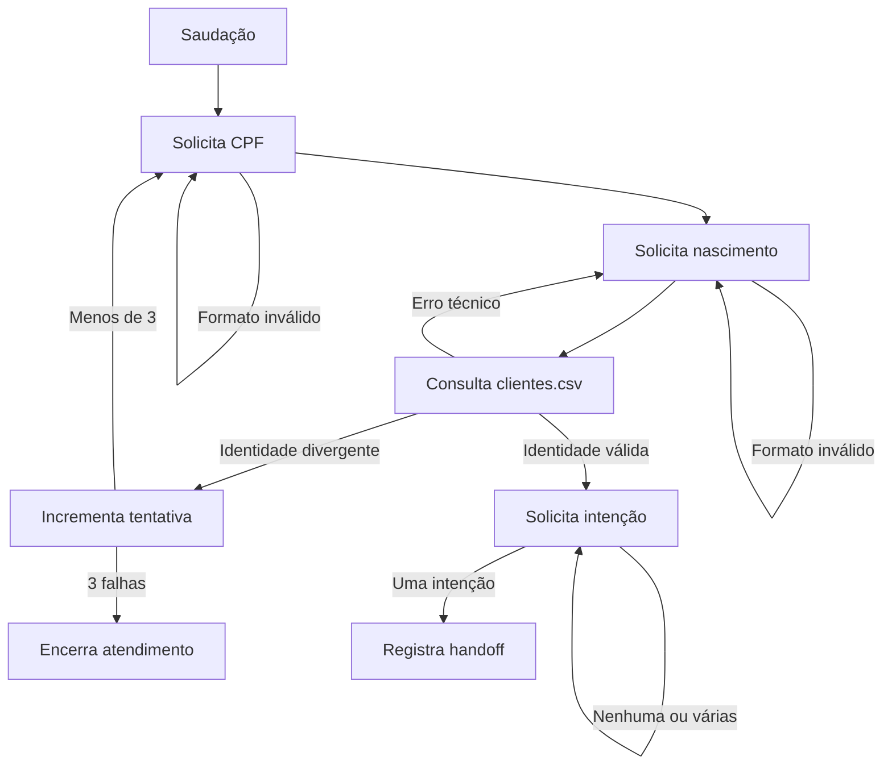

# Sprint 1 - Núcleo Determinístico da Triagem

## Resumo executivo

Esta sprint implementa a primeira regra funcional do desafio: autenticar o cliente por CPF
e data de nascimento antes de permitir acesso aos demais serviços. A solução usa uma
máquina de estados determinística, consulta `clientes.csv`, permite até três falhas
consecutivas e registra eventos de auditoria sem dados pessoais brutos.

**Status:** concluída tecnicamente e aguardando merge da PR.

**Qualidade:** Ruff, MyPy strict e GitHub Actions aprovados; 64 testes; 100% de cobertura
de linhas e branches.

## Objetivo da sprint

Entregar o núcleo da Triagem independentemente de interface ou framework de orquestração.
Ao final, as regras devem poder ser executadas e testadas sem Streamlit, LangGraph ou LLM.

## Requisitos do PDF atendidos

- Saudação inicial.
- Coleta do CPF.
- Coleta da data de nascimento.
- Validação em `clientes.csv`.
- Identificação de intenção somente após autenticação.
- Primeira tentativa e até duas novas tentativas.
- Encerramento amigável na terceira falha consecutiva.
- Roteamento para Crédito, Entrevista ou Câmbio.
- Encerramento solicitado pelo usuário durante a Triagem.
- Tratamento controlado de falhas de leitura e dados inválidos.
- Registro técnico para análise posterior.

## Escopo

### Incluído

- Modelo imutável de cliente.
- Estado conversacional com data de nascimento.
- Validação e normalização das entradas.
- Porta de repositório e adaptador CSV.
- Máquina de estados da Triagem.
- Identificação determinística de intenção.
- Ferramenta de encerramento.
- Integração com auditoria pseudonimizada.
- Dados fictícios de demonstração.
- Testes unitários e de integração.
- Atualização do README.

### Não incluído

- Interface Streamlit.
- Grafo de orquestração entre agentes.
- Execução dos agentes de Crédito, Entrevista e Câmbio.
- Classificação de intenção por LLM.
- Persistência de produção.

Esses itens foram adiados intencionalmente. Implementar interface e framework antes das
regras dificultaria isolar defeitos e aumentaria o acoplamento.

## Fluxo implementado

## Alterações por responsabilidade

### Estado e domínio

- `app/models/conversation.py`: adiciona `birth_date` ao estado.
- `app/models/customer.py`: representa cliente, limite e score com invariantes.

### Persistência

- `app/repositories/customers.py`: define `CustomerRepository` e implementa leitura segura
  de `clientes.csv`.
- `data/clientes.csv`: contém somente registros fictícios para demonstração.

### Ferramentas determinísticas

- `app/tools/identity.py`: normaliza CPF e interpreta nascimento.
- `app/tools/conversation.py`: reconhece encerramento, normaliza texto e remove dados
  pessoais do estado finalizado.

### Agente

- `app/agents/triage.py`: implementa os estágios, as três tentativas, a autenticação, a
  intenção e os eventos de auditoria.

### Testes

- Testes unitários para modelos, entradas, encerramento, CSV e agente.
- Teste integrado com o `clientes.csv` real e persistência JSONL.
- Verificação de que CPF, nascimento e nome não aparecem na auditoria.

## Decisões arquiteturais

### 1. Autenticação determinística

**Decisão:** autenticação é executada por código normal e comparação no CSV.

**Por quê:** identidade é uma regra crítica e precisa produzir sempre o mesmo resultado
para a mesma entrada.

**Por que não LLM:** modelos podem interpretar, variar respostas e inventar dados. Uma LLM
não deve decidir se duas identidades correspondem.

### 2. Máquina de estados explícita

**Decisão:** a Triagem possui `greeting`, `awaiting_cpf`, `awaiting_birth_date` e
`awaiting_intent`.

**Por quê:** cada mensagem só pode ser processada dentro de um contexto permitido.

**Por que não um único prompt:** um prompt precisaria inferir o estágio a cada turno e
poderia coletar ou rotear dados fora de ordem.

### 3. `TypedDict` para estado

**Decisão:** manter o estado leve e tipado.

**Por quê:** o formato é adequado para estado compartilhado em grafos e é verificado pelo
MyPy.

**Por que não Pydantic agora:** ainda não há API HTTP nem payload externo complexo. As
entradas são validadas por funções de fronteira, evitando uma dependência prematura.

### 4. `Customer` imutável

**Decisão:** usar `dataclass(frozen=True, slots=True)` com validações.

**Por quê:** o cliente encontrado é um valor de domínio e não deve ser alterado
acidentalmente pelo agente.

**Por que não dicionário:** dicionários não garantem campos, tipos ou invariantes de score
e limite.

### 5. `Decimal` para valores monetários

**Decisão:** limite de crédito usa `Decimal`.

**Por quê:** valores financeiros precisam de representação decimal previsível.

**Por que não `float`:** ponto flutuante binário pode produzir diferenças de precisão em
cálculos e comparações monetárias.

### 6. Repositório entre agente e CSV

**Decisão:** `TriageAgent` depende da interface `CustomerRepository`.

**Por quê:** a regra não precisa conhecer abertura de arquivos, cabeçalhos ou parsing.

**Por que não abrir CSV no agente:** isso misturaria conversa, negócio e armazenamento,
dificultando testes e futura troca por banco de dados.

### 7. Entrada inválida não consome tentativa

**Decisão:** CPF curto ou data mal formatada apenas gera nova solicitação.

**Por quê:** ainda não ocorreu comparação de identidade.

**Por que não contabilizar tudo:** puniria o cliente por erro de digitação e poderia
encerrar a conversa sem três tentativas reais de autenticação.

### 8. Falha técnica não consome tentativa

**Decisão:** arquivo ausente, esquema inválido ou erro de leitura é separado de identidade
divergente.

**Por quê:** indisponibilidade do sistema não é falha do cliente.

**Por que não retornar “dados incorretos”:** esconderia um incidente operacional e
produziria uma conclusão falsa sobre a identidade.

### 9. Intenção controlada antes da LLM

**Decisão:** termos conhecidos identificam Crédito, Entrevista ou Câmbio. Nenhuma ou várias
intenções geram pedido de esclarecimento.

**Por quê:** entrega um baseline reproduzível e suficiente para conectar o grafo.

**Por que não LLM nesta sprint:** primeiro precisamos de roteamento testável. Uma LLM pode
ser adicionada depois apenas como fallback limitado aos destinos autorizados.

### 10. Auditoria por eventos mínimos

**Decisão:** registrar tipo, resultado, motivo, agente, turno e referência pseudonimizada.

**Por quê:** esses campos reconstroem o fluxo sem armazenar a conversa completa.

**Por que não salvar mensagens:** mensagens podem conter CPF, nascimento e informações
financeiras desnecessárias para a trilha de decisão.

### 11. HMAC-SHA-256 para referência do titular

**Decisão:** gerar `subject_ref` com CPF e chave secreta.

**Por quê:** permite correlacionar eventos sem gravar o identificador bruto.

**Por que não SHA-256 simples:** CPF possui espaço de busca limitado e um hash sem chave
pode ser testado por força bruta.

### 12. Remoção dos dados no encerramento

**Decisão:** CPF, nascimento, nome e autenticação são removidos do estado encerrado.

**Por quê:** esses dados deixam de ser necessários depois do fim da conversa.

**Por que não manter por conveniência:** retenção sem finalidade aumenta o impacto de
vazamentos e contraria o princípio de minimização.

### 13. LangGraph e Streamlit adiados

**Decisão:** entrarão na Sprint 2.

**Por quê:** a regra da Triagem precisava funcionar sem depender de UI ou framework.

**Por que não começar pela interface:** uma tela funcionando poderia esconder regras
incorretas e tornaria os testes mais lentos e frágeis.

## Matriz de aceite

| Cenário | Resultado esperado | Coberto |
| --- | --- | --- |
| CPF formatado válido | Normaliza para 11 dígitos | Sim |
| CPF mal formatado | Solicita novamente, sem consumir tentativa | Sim |
| Nascimento inválido | Solicita novamente, sem consultar CSV | Sim |
| Identidade válida | Autentica e solicita intenção | Sim |
| Identidade divergente | Incrementa uma tentativa | Sim |
| Terceira divergência | Encerra amigavelmente | Sim |
| CSV indisponível | Informa erro e preserva tentativas | Sim |
| Esquema incorreto | Gera erro controlado | Sim |
| Registro duplicado | Gera erro controlado | Sim |
| Intenção única | Realiza handoff | Sim |
| Intenção ambígua | Solicita esclarecimento | Sim |
| Pedido de fim | Encerra e remove dados pessoais | Sim |
| Auditoria | Não contém CPF, nascimento ou nome | Sim |

## Limitações conhecidas

- O handoff altera o agente ativo, mas o agente de destino ainda não é executado.
- A interface Streamlit ainda não existe.
- A classificação por palavras não cobre toda variação da linguagem natural.
- O CSV não oferece concorrência transacional.
- O JSONL não é armazenamento de auditoria para múltiplas instâncias.
- Gestão e rotação da chave HMAC ainda dependem da configuração da aplicação.

Essas limitações são conhecidas, documentadas e estão alinhadas às próximas sprints.

## Perguntas e respostas para estudo

### 1. Por que autenticação não usa inteligência artificial?

Porque autenticação exige resultado determinístico, reproduzível e auditável. A LLM pode
ajudar a conversar, mas não confirmar identidade.

### 2. O que a máquina de estados resolve?

Ela define quais entradas são válidas em cada momento e impede coleta, roteamento ou
resposta fora de ordem.

### 3. Por que usar `TypedDict`?

Para tornar o contrato do estado explícito e verificável pelo MyPy sem adicionar uma camada
de runtime desnecessária neste momento.

### 4. Quando Pydantic passaria a fazer sentido?

Na entrada de uma API HTTP, configuração externa complexa ou serialização que precise de
validação em runtime.

### 5. Por que o cliente é imutável?

Para evitar alterações acidentais nos dados carregados e deixar atualizações explícitas no
repositório responsável.

### 6. Por que usar `Decimal` para limite?

Porque dinheiro precisa de precisão decimal previsível; `float` representa números em
ponto flutuante binário.

### 7. O que é o Repository Pattern neste projeto?

É a separação entre a regra que solicita um cliente e o adaptador que sabe ler o CSV. O
agente depende do contrato, não do arquivo.

### 8. Por que um CPF inválido no formato não consome tentativa?

Porque nenhuma autenticação ocorreu. O sistema ainda não conseguiu comparar uma identidade
com a base.

### 9. Por que erro no CSV também não consome tentativa?

Porque falha operacional é responsabilidade do sistema, não do cliente.

### 10. Como garantimos exatamente três tentativas?

A tentativa é incrementada somente após uma comparação divergente e comparada com a
constante `MAX_AUTHENTICATION_ATTEMPTS = 3`.

### 11. Como impedimos acesso antecipado a outro agente?

A intenção só é tratada no estágio `awaiting_intent`, alcançado depois de uma identidade
válida. Depois do handoff, a Triagem também recusa novas respostas.

### 12. Por que o handoff é implícito?

Porque o PDF exige que o cliente perceba um único assistente. Alteramos o agente interno e
continuamos a conversa sem anunciar uma transferência técnica.

### 13. O que acontece com uma intenção ambígua?

O sistema não escolhe silenciosamente. Ele pede ao cliente para selecionar uma necessidade
por vez.

### 14. Por que HMAC é melhor que hash simples para CPF?

HMAC depende de uma chave secreta. Um hash simples de CPF pode ser comparado contra uma
lista gerada de possíveis documentos.

### 15. Pseudonimização transforma o dado em anônimo?

Não. Se a organização ainda consegue correlacionar a referência ao titular, ela continua
sendo dado pessoal pseudonimizado.

### 16. Por que não auditamos a mensagem completa?

Porque ela pode conter dados pessoais e financeiros. Eventos e códigos de motivo são
suficientes para reconstituir a decisão.

### 17. Por que removemos dados do estado ao encerrar?

Porque CPF, nascimento e nome já não são necessários. Isso reduz retenção e exposição.

### 18. Cem por cento de cobertura significa ausência de bugs?

Não. Cobertura mostra que as linhas e branches foram exercitados, mas a qualidade depende
dos cenários e das assertivas. Por isso também existe teste integrado e matriz de aceite.

### 19. Por que não usamos LangGraph ainda?

Com apenas a Triagem implementada, o framework não resolveria um problema real de
orquestração. Ele será introduzido quando houver grafo e handoffs executáveis.

### 20. O que mudaria em produção?

CSV seria substituído por armazenamento transacional; auditoria iria para storage central
append-only; chaves ficariam em secret manager; haveria rate limiting, métricas, tracing,
controle de acesso e procedimentos formais de retenção e incidentes.

## Resposta de 60 segundos para entrevista

> Na primeira sprint eu implementei o núcleo determinístico da Triagem. Modelei a conversa
> como uma máquina de estados, validei CPF e nascimento e isolei o `clientes.csv` atrás de
> um repositório. Uma entrada mal formatada ou falha técnica não consome tentativa; apenas
> uma identidade realmente divergente conta para o limite de três. O roteamento só acontece
> após autenticação e gera um handoff auditável. A auditoria não recebe CPF, nascimento,
> nome ou mensagens: usamos uma referência HMAC pseudonimizada. Também removemos os dados
> pessoais do estado ao encerrar. Adiei Streamlit e LangGraph para a próxima sprint porque
> primeiro queria provar as regras independentemente do framework. O resultado passou em
> MyPy strict, CI e 64 testes com cobertura integral de linhas e branches.

## Glossário rápido

- **Determinístico:** mesma entrada e estado produzem a mesma decisão.
- **Máquina de estados:** conjunto explícito de etapas e transições permitidas.
- **Porta:** contrato usado pela regra de negócio para acessar uma capacidade externa.
- **Adaptador:** implementação concreta da porta, como leitura de CSV.
- **Invariante:** condição que um objeto válido deve sempre respeitar.
- **HMAC:** código criptográfico com chave secreta usado para gerar referência estável.
- **Pseudonimização:** substituição de identificador direto por referência controlada.
- **Handoff:** transferência interna do atendimento entre agentes.
- **Branch coverage:** medida de caminhos condicionais executados pelos testes.
- **Fail safe:** comportamento controlado quando uma dependência falha.
